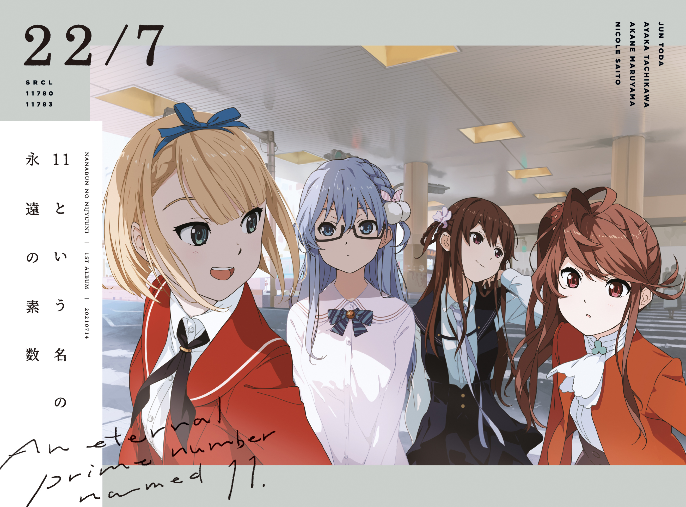
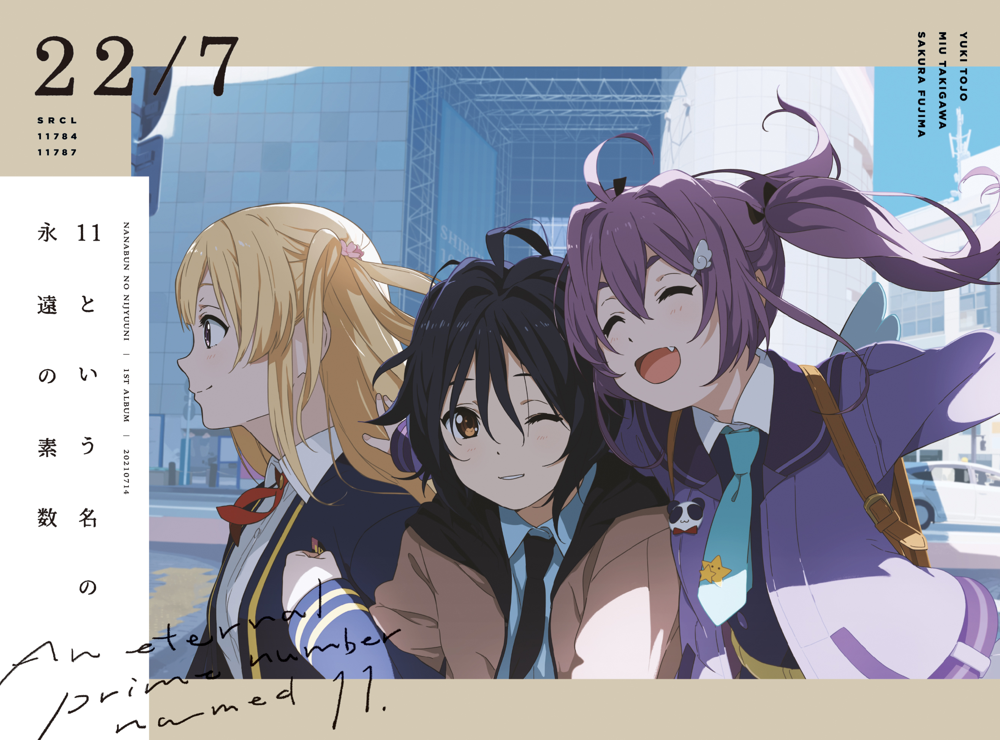
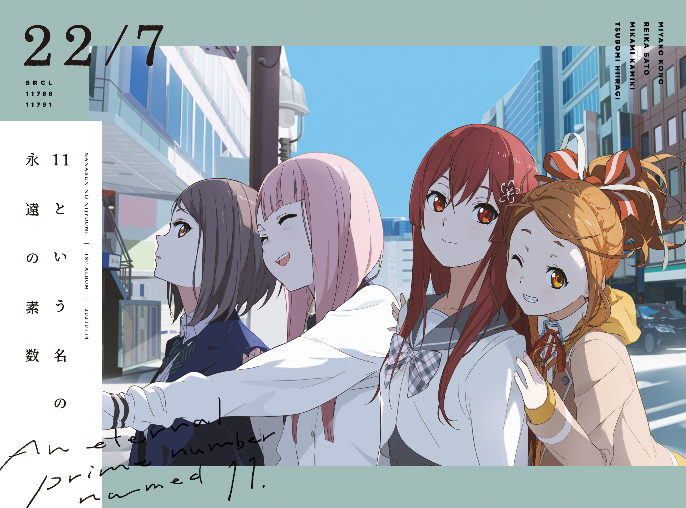
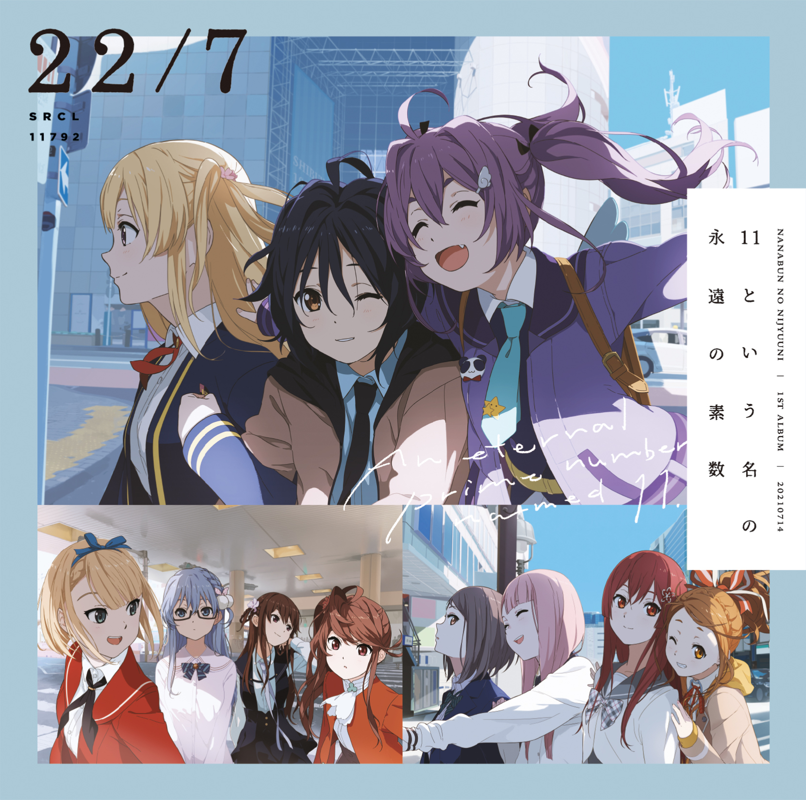

### 11という名の永遠の素数 An Eternal Prime Number Named 11
##### [Back](Music_List.md)

#### 11という名の永遠の素数【完全生産限定盤A】
 
Date: 14Jul,2021 

<blockquote>
Disc 1 
1. OVERTURE 
2. 僕は存在していなかった 
3. シャンプーの匂いがした 
4. 理解者 
5. 何もしてあげられない 
6. ムズイ 
7. 風は吹いてるか？ 
8. 僕が持ってるものなら 
9. ヒヤシンス 
10. 空を飛んでみよう 
11. 11人が集まった理由 
 
Disc 2 
1. One of them 
2. 生きることに楽になりたい 
3. 夢の船 
4. 優等生じゃつまらない 
5. 人生はワルツ 
6. 感情無用論 
7. Moonlight 
8. 孤独は嫌いじゃない 
9. 神様に指を差された僕たち 
</blockquote>
 

#### 11という名の永遠の素数【完全生産限定盤B】
 
Date: 14Jul,2021 

<blockquote>
Disc 1 
1. OVERTURE 
2. 僕は存在していなかった 
3. シャンプーの匂いがした 
4. 理解者 
5. 何もしてあげられない 
6. ムズイ 
7. 風は吹いてるか？ 
8. 僕が持ってるものなら 
9. ヒヤシンス 
10. 空を飛んでみよう 
11. 11人が集まった理由 
 
Disc 2 
1. 半チャーハン 
2. To goでよろしく！ 
3. タトゥー・ラブ 
4. 交換条件 
5. ソフトクリーム落としちゃった 
6. 好きになるのは自由だし… 
7. キウイの主張 (白組) 
8. 雷鳴のDelay (紅組) 
</blockquote>
 

#### 11という名の永遠の素数【完全生産限定盤C】
 
Date: 14Jul,2021 

<blockquote>
Disc 1 
1. OVERTURE 
2. 僕は存在していなかった 
3. シャンプーの匂いがした 
4. 理解者 
5. 何もしてあげられない 
6. ムズイ 
7. 風は吹いてるか？ 
8. 僕が持ってるものなら 
9. ヒヤシンス 
10. 空を飛んでみよう 
11. 11人が集まった理由 
 
Disc 2 
1. 絶望の花 
2. 僕らの環境 
3. とんぼの気持ち 
4. 地下鉄抵抗主義 
5. Rain of lies 
6. 韋駄天娘 
7. 未来があるから 
8. ポニーテールは振り向かせない 
9. 循環バス 
10. 君はMoon 
11. 空のエメラルド 
</blockquote>
 

#### 11という名の永遠の素数【通常盤】
 
Date: 14Jul,2021 

<blockquote>
1. OVERTURE 
2. 僕は存在していなかった 
3. シャンプーの匂いがした 
4. 理解者 
5. 何もしてあげられない 
6. ムズイ 
7. 風は吹いてるか？ 
8. 僕が持ってるものなら 
9. ヒヤシンス 
10. 空を飛んでみよう 
11. 11人が集まった理由 
</blockquote>
 

#### ヒヤシンス 先行配信
 
Date: 26May,2021 

<blockquote>
1. ヒヤシンス 
2. ヒヤシンス (Instrumental) 
</blockquote>
 

試聽 Preview 

**01. OVERTURE** 
<audio controls="controls">
  <source type="audio/mp3" src="../../Music/Album_01_An%20Eternal%20Prime%20Number%20Named%2011/01.%20OVERTURE.mp3"></source>
  
Your browser does not support the audio element.

</audio>

**02. 僕は存在していなかった** 
<audio controls="controls">
  <source type="audio/mp3" src="../../Music/Album_01_An%20Eternal%20Prime%20Number%20Named%2011/02.%20僕は存在していなかった.mp3"></source>
  
Your browser does not support the audio element.

</audio>

**03. シャンプーの匂いがした** 
<audio controls="controls">
  <source type="audio/mp3" src="../../Music/Album_01_An%20Eternal%20Prime%20Number%20Named%2011/03.%20シャンプーの匂いがした.mp3"></source>
  
Your browser does not support the audio element.

</audio>

**04. 理解者** 
<audio controls="controls">
  <source type="audio/mp3" src="../../Music/Album_01_An%20Eternal%20Prime%20Number%20Named%2011/04.%20理解者.mp3"></source>
  
Your browser does not support the audio element.

</audio>

**05. 何もしてあげられない** 
<audio controls="controls">
  <source type="audio/mp3" src="../../Music/Album_01_An%20Eternal%20Prime%20Number%20Named%2011/05.%20何もしてあげられない.mp3"></source>
  
Your browser does not support the audio element.

</audio>

**06. ムズイ** 
<audio controls="controls">
  <source type="audio/mp3" src="../../Music/Album_01_An%20Eternal%20Prime%20Number%20Named%2011/06.%20ムズイ.mp3"></source>
  
Your browser does not support the audio element.

</audio>

**07. 風は吹いてるか？** 
<audio controls="controls">
  <source type="audio/mp3" src="../../Music/Album_01_An%20Eternal%20Prime%20Number%20Named%2011/07.%20風は吹いてるか？.mp3"></source>
  
Your browser does not support the audio element.

</audio>

**08. 僕が持ってるものなら** 
<audio controls="controls">
  <source type="audio/mp3" src="../../Music/Album_01_An%20Eternal%20Prime%20Number%20Named%2011/08.%20僕が持ってるものなら.mp3"></source>
  
Your browser does not support the audio element.

</audio>

**09. ヒヤシンス** 
<audio controls="controls">
  <source type="audio/mp3" src="../../Music/Album_01_An%20Eternal%20Prime%20Number%20Named%2011/09.%20ヒヤシンス.mp3"></source>
  
Your browser does not support the audio element.

</audio>

**10. 空を飛んでみよう** 
<audio controls="controls">
  <source type="audio/mp3" src="../../Music/Album_01_An%20Eternal%20Prime%20Number%20Named%2011/10.%20空を飛んでみよう.mp3"></source>
  
Your browser does not support the audio element.

</audio>

**11. 11人が集まった理由** 
<audio controls="controls">
  <source type="audio/mp3" src="../../Music/Album_01_An%20Eternal%20Prime%20Number%20Named%2011/11.%2011人が集まった理由.mp3"></source>
  
Your browser does not support the audio element.

</audio>

【完全生産限定盤A】 
**01. One of them** 
<audio controls="controls">
  <source type="audio/mp3" src="../../Music/Album_01_An%20Eternal%20Prime%20Number%20Named%2011/CompleteA/01.%20One%20of%20them.mp3"></source>
  
Your browser does not support the audio element.

</audio>

**02. 生きることに楽になりたい** 
<audio controls="controls">
  <source type="audio/mp3" src="../../Music/Album_01_An%20Eternal%20Prime%20Number%20Named%2011/CompleteA/02.%20生きることに楽になりたい.mp3"></source>
  
Your browser does not support the audio element.

</audio>

**03. 夢の船** 
<audio controls="controls">
  <source type="audio/mp3" src="../../Music/Album_01_An%20Eternal%20Prime%20Number%20Named%2011/CompleteA/03.%20夢の船.mp3"></source>
  
Your browser does not support the audio element.

</audio>

**04. 優等生じゃつまらない** 
<audio controls="controls">
  <source type="audio/mp3" src="../../Music/Album_01_An%20Eternal%20Prime%20Number%20Named%2011/CompleteA/04.%20優等生じゃつまらない.mp3"></source>
  
Your browser does not support the audio element.

</audio>

**05. 人生はワルツ** 
<audio controls="controls">
  <source type="audio/mp3" src="../../Music/Album_01_An%20Eternal%20Prime%20Number%20Named%2011/CompleteA/05.%20人生はワルツ.mp3"></source>
  
Your browser does not support the audio element.

</audio>

**06. 感情無用論** 
<audio controls="controls">
  <source type="audio/mp3" src="../../Music/Album_01_An%20Eternal%20Prime%20Number%20Named%2011/CompleteA/06.%20感情無用論.mp3"></source>
  
Your browser does not support the audio element.

</audio>

**07. Moonlight** 
<audio controls="controls">
  <source type="audio/mp3" src="../../Music/Album_01_An%20Eternal%20Prime%20Number%20Named%2011/CompleteA/07.%20Moonlight.mp3"></source>
  
Your browser does not support the audio element.

</audio>

**08. 孤独は嫌いじゃない** 
<audio controls="controls">
  <source type="audio/mp3" src="../../Music/Album_01_An%20Eternal%20Prime%20Number%20Named%2011/CompleteA/09.%20孤独は嫌いじゃない.mp3"></source>
  
Your browser does not support the audio element.

</audio>

**09. 神様に指を差された僕たち** 
<audio controls="controls">
  <source type="audio/mp3" src="../../Music/Album_01_An%20Eternal%20Prime%20Number%20Named%2011/CompleteA/08.%20神様に指を差された僕たち.mp3"></source>
  
Your browser does not support the audio element.

</audio>

【完全生産限定盤B】 
**01. 半チャーハン** 
<audio controls="controls">
  <source type="audio/mp3" src="../../Music/Album_01_An%20Eternal%20Prime%20Number%20Named%2011/CompleteB/01.%20半チャーハン.mp3"></source>
  
Your browser does not support the audio element.

</audio>

**02. To goでよろしく！** 
<audio controls="controls">
  <source type="audio/mp3" src="../../Music/Album_01_An%20Eternal%20Prime%20Number%20Named%2011/CompleteB/06.%20To%20goでよろしく！.mp3"></source>
  
Your browser does not support the audio element.

</audio>

**03. タトゥー・ラブ** 
<audio controls="controls">
  <source type="audio/mp3" src="../../Music/Album_01_An%20Eternal%20Prime%20Number%20Named%2011/CompleteB/03.%20タトゥー・ラブ.mp3"></source>
  
Your browser does not support the audio element.

</audio>

**04. 交換条件** 
<audio controls="controls">
  <source type="audio/mp3" src="../../Music/Album_01_An%20Eternal%20Prime%20Number%20Named%2011/CompleteB/04.%20交換条件.mp3"></source>
  
Your browser does not support the audio element.

</audio>

**05. ソフトクリーム落としちゃった** 
<audio controls="controls">
  <source type="audio/mp3" src="../../Music/Album_01_An%20Eternal%20Prime%20Number%20Named%2011/CompleteB/05.%20ソフトクリーム落としちゃった.mp3"></source>
  
Your browser does not support the audio element.

</audio>

**06. 好きになるのは自由だし…** 
<audio controls="controls">
  <source type="audio/mp3" src="../../Music/Album_01_An%20Eternal%20Prime%20Number%20Named%2011/CompleteB/02.%20好きになるのは自由だし….mp3"></source>
  
Your browser does not support the audio element.

</audio>

**07. キウイの主張 (白組)** 
<audio controls="controls">
  <source type="audio/mp3" src="../../Music/Album_01_An%20Eternal%20Prime%20Number%20Named%2011/CompleteB/08.%20キウイの主張%20(白組).mp3"></source>
  
Your browser does not support the audio element.

</audio>

**08. 雷鳴のDelay (紅組)** 
<audio controls="controls">
  <source type="audio/mp3" src="../../Music/Album_01_An%20Eternal%20Prime%20Number%20Named%2011/CompleteB/07.%20雷鳴のDelay%20(紅組).mp3"></source>
  
Your browser does not support the audio element.

</audio>

【完全生産限定盤C】 
**01. 絶望の花** 
<audio controls="controls">
  <source type="audio/mp3" src="../../Music/Album_01_An%20Eternal%20Prime%20Number%20Named%2011/CompleteC/01.%20絶望の花.mp3"></source>
  
Your browser does not support the audio element.

</audio>

**02. 僕らの環境** 
<audio controls="controls">
  <source type="audio/mp3" src="../../Music/Album_01_An%20Eternal%20Prime%20Number%20Named%2011/CompleteC/02.%20僕らの環境.mp3"></source>
  
Your browser does not support the audio element.

</audio>

**03. とんぼの気持ち** 
<audio controls="controls">
  <source type="audio/mp3" src="../../Music/Album_01_An%20Eternal%20Prime%20Number%20Named%2011/CompleteC/03.%20とんぼの気持ち.mp3"></source>
  
Your browser does not support the audio element.

</audio>

**04. 地下鉄抵抗主義** 
<audio controls="controls">
  <source type="audio/mp3" src="../../Music/Album_01_An%20Eternal%20Prime%20Number%20Named%2011/CompleteC/04.%20地下鉄抵抗主義.mp3"></source>
  
Your browser does not support the audio element.

</audio>

**05. Rain of lies** 
<audio controls="controls">
  <source type="audio/mp3" src="../../Music/Album_01_An%20Eternal%20Prime%20Number%20Named%2011/CompleteC/05.%20Rain%20of%20lies.mp3"></source>
  
Your browser does not support the audio element.

</audio>

**06. 韋駄天娘** 
<audio controls="controls">
  <source type="audio/mp3" src="../../Music/Album_01_An%20Eternal%20Prime%20Number%20Named%2011/CompleteC/06.%20韋駄天娘.mp3"></source>
  
Your browser does not support the audio element.

</audio>

**07. 未来があるから** 
<audio controls="controls">
  <source type="audio/mp3" src="../../Music/Album_01_An%20Eternal%20Prime%20Number%20Named%2011/CompleteC/07.%20未来があるから.mp3"></source>
  
Your browser does not support the audio element.

</audio>

**08. ポニーテールは振り向かせない** 
<audio controls="controls">
  <source type="audio/mp3" src="../../Music/Album_01_An%20Eternal%20Prime%20Number%20Named%2011/CompleteC/08.%20ポニーテールは振り向かせない.mp3"></source>
  
Your browser does not support the audio element.

</audio>

**09. 循環バス** 
<audio controls="controls">
  <source type="audio/mp3" src="../../Music/Album_01_An%20Eternal%20Prime%20Number%20Named%2011/CompleteC/09.%20循環バス.mp3"></source>
  
Your browser does not support the audio element.

</audio>

**10. 君はMoon** 
<audio controls="controls">
  <source type="audio/mp3" src="../../Music/Album_01_An%20Eternal%20Prime%20Number%20Named%2011/CompleteC/10.%20君はMoon.mp3"></source>
  
Your browser does not support the audio element.

</audio>

**11. 空のエメラルド** 
<audio controls="controls">
  <source type="audio/mp3" src="../../Music/Album_01_An%20Eternal%20Prime%20Number%20Named%2011/CompleteC/11.%20空のエメラルド.mp3"></source>
  
Your browser does not support the audio element.

</audio>

先行配信 
**01. ヒヤシンス** 
<audio controls="controls">
  <source type="audio/mp3" src="../../Music/Album_01_An%20Eternal%20Prime%20Number%20Named%2011/先行配信/01.%20ヒヤシンス.flac"></source>
  
Your browser does not support the audio element.

</audio>

**02. ヒヤシンス (Instrumental)** 
<audio controls="controls">
  <source type="audio/mp3" src="../../Music/Album_01_An%20Eternal%20Prime%20Number%20Named%2011/先行配信/02.%20ヒヤシンス%20(Instrumental).flac"></source>
  
Your browser does not support the audio element.

</audio>