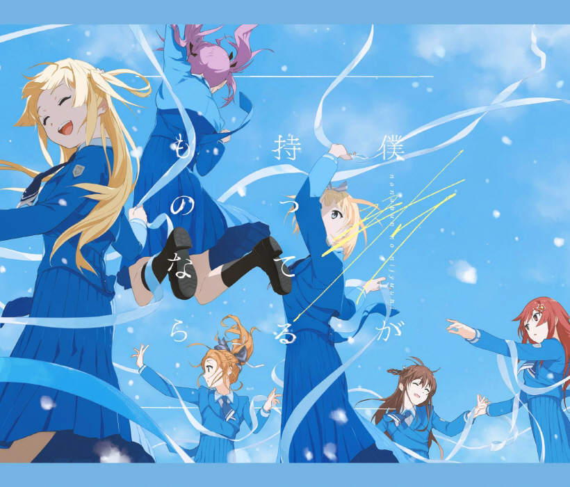
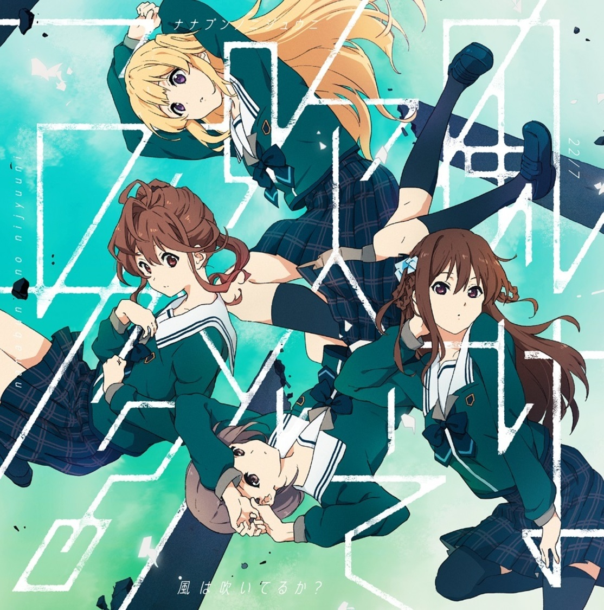
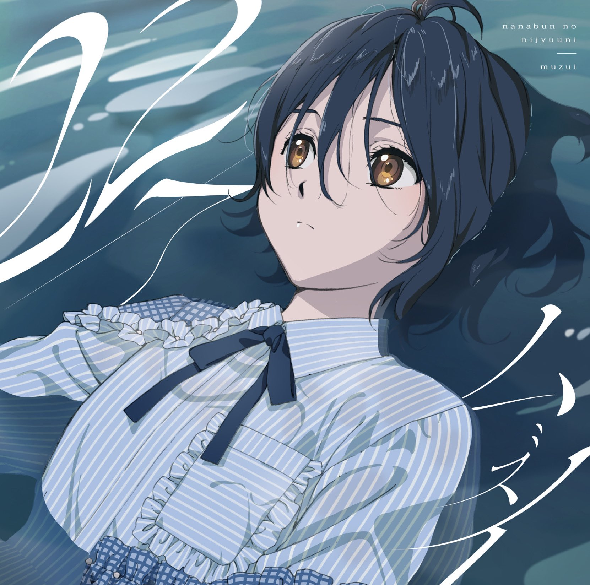
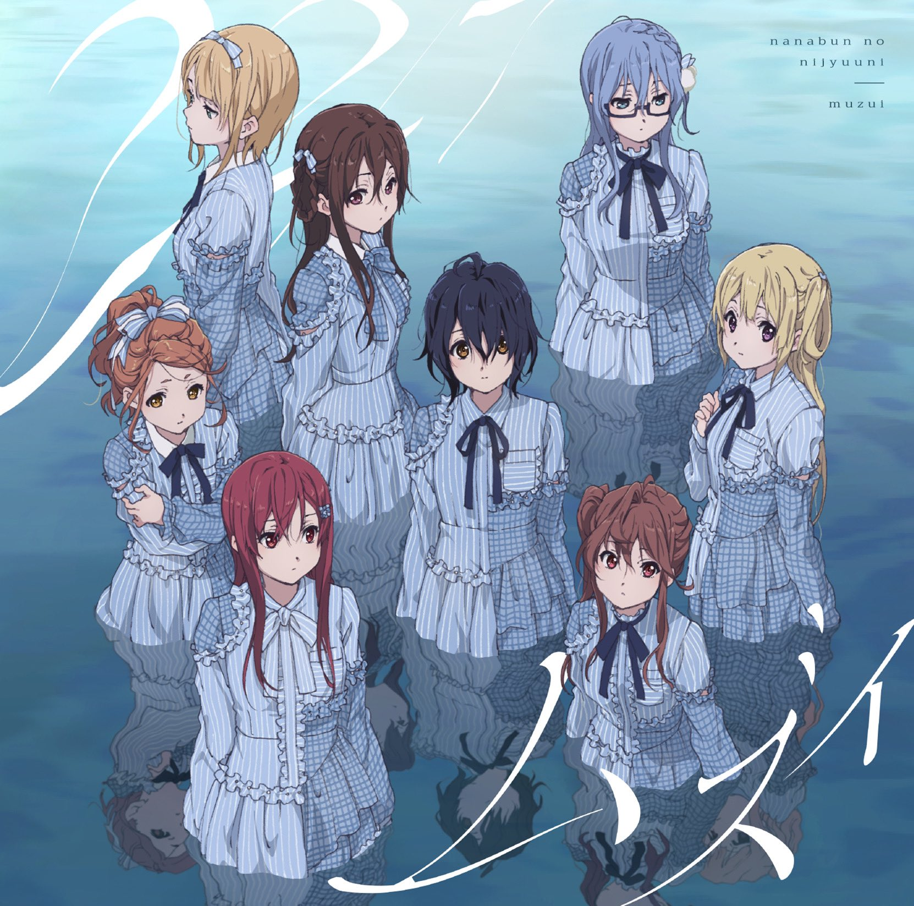
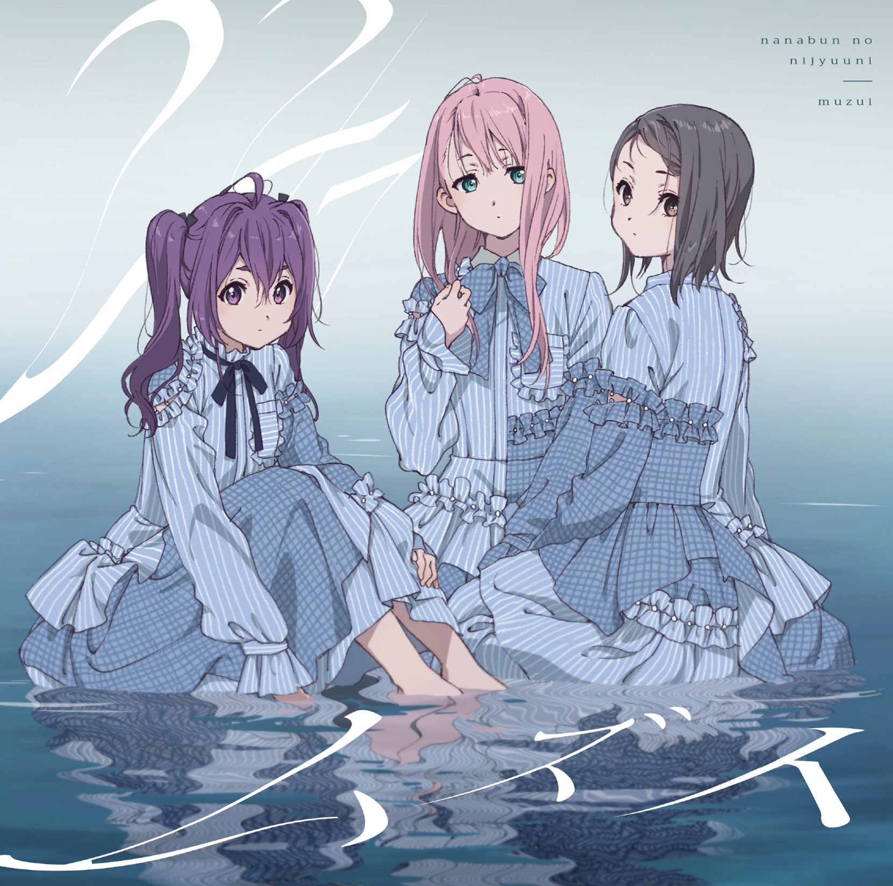
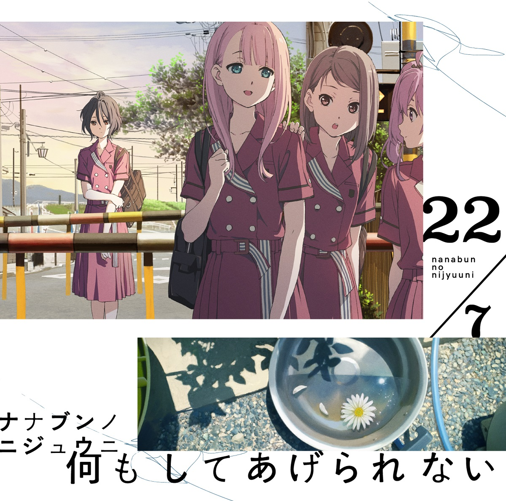
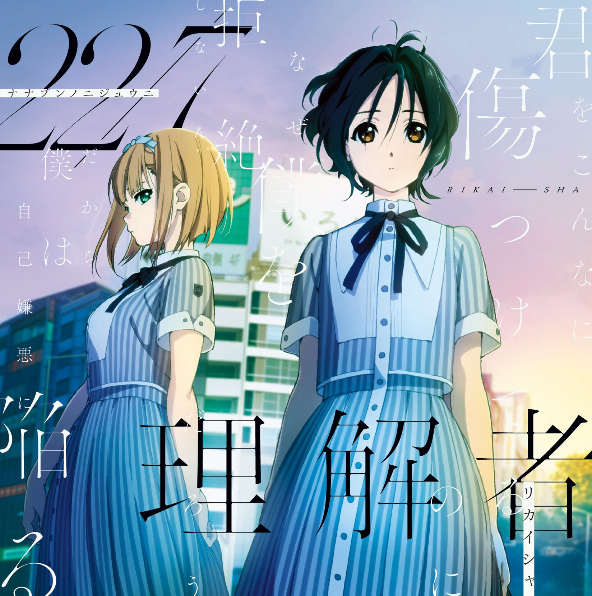
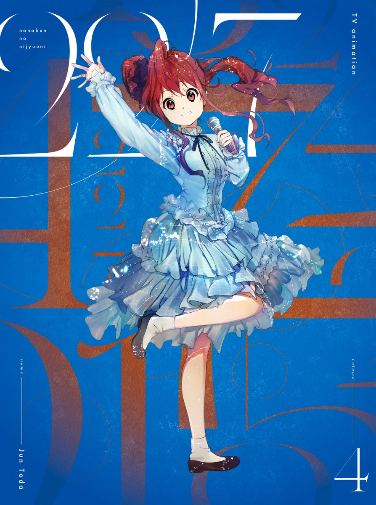
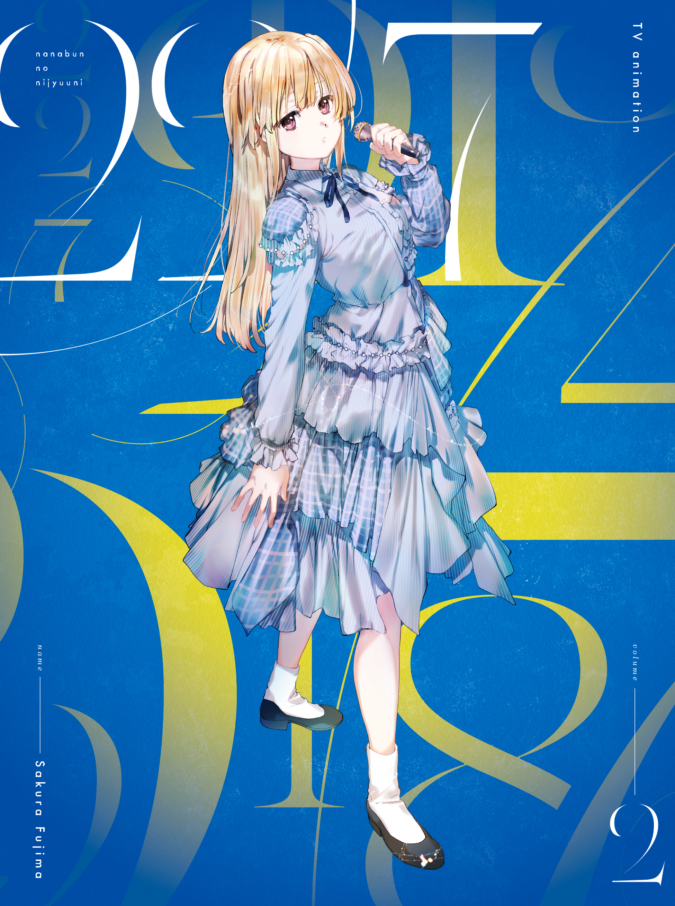
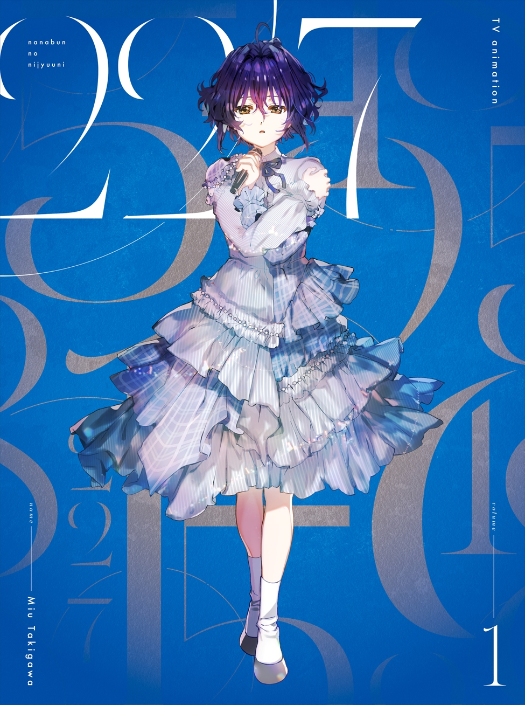

### 音樂 Music
##### [Back](../../readme.md)

<table>
<tr>
<th><a href="#single">單曲 Single</a></th>
<th><a href="#digitial_single">數位單曲 Digitial Single</a></th>
</tr>
<tr>
<th><a href="#album">專輯 Album</a></th>
<th><a href="#bddvd">BD & DVD</a></th>
</tr>
<tr>
<th><a href="#Ongaku_no_Jikan">音楽の時間 Ongaku no Jikan</a></th>
</tr>
</table>

#### 單曲 Single

- [僕が持ってるものなら Boku ga Motteru Mono Nara](Single_07.html) 

- [風は吹いてるか? Kaze wa Fuiteruka](Single_06.html) 

- [ムズイ Muzui](Single_05.html) 

- [何もしてあげられない Nani Mo Shiteagerarenai](Single_04.html) 

- [理解者 Rikaisha](Single_03.html) 

- [シャンプーの匂いがした Shampoo no Nioi ga Shita](Single_02.html) 

- [僕は存在していなかった Boku wa Sonzai Shiteinakatta](Single_01.html) 

#### 數位單曲 Digitial Single

- [風は吹いてるか? Kaze wa Fuiteruka](Kaze%20wa%20Fuiteruka.html) 

#### 專輯 Album

- [11という名の永遠の素数 11 To Iu Na No Eien No Sosu](Album_01.html) 

#### BD & DVD

- [BD & DVD Vol.6](BDDVD%20Vol6.html) 
 

- [BD & DVD Vol.5](BDDVD%20Vol5.html) 

- [BD & DVD Vol.4](BDDVD%20Vol4.html) 
 

- [BD & DVD Vol.3](BDDVD%20Vol3.html) 
 

- [BD & DVD Vol.2](BDDVD%20Vol2.html) 

- [BD & DVD Vol.1](BDDVD%20Vol1.html) 

#### 音楽の時間 Ongaku no Jikan

- [22/7 音楽の時間 Ongaku no Jikan](227%20Ongaku%20no%20Jikan.html) 
