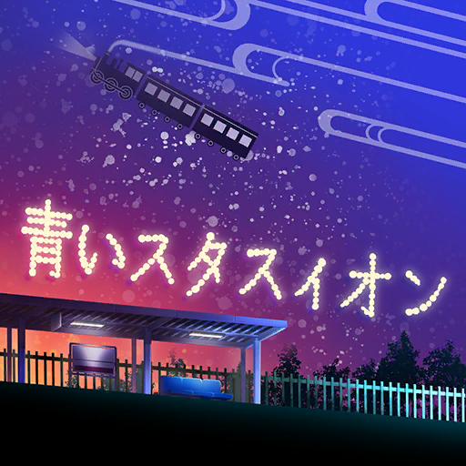
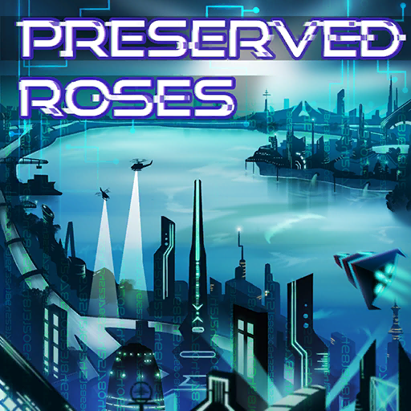
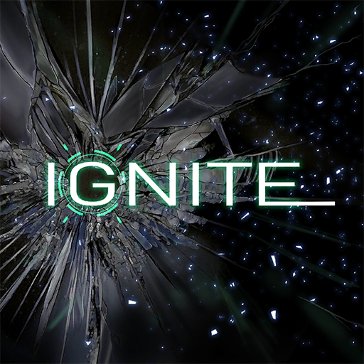
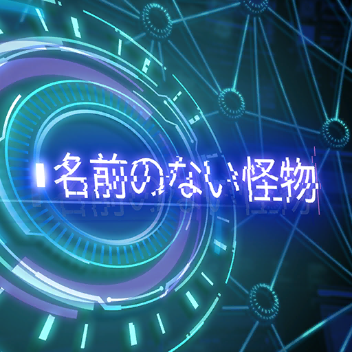
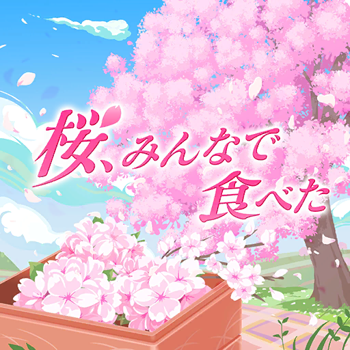
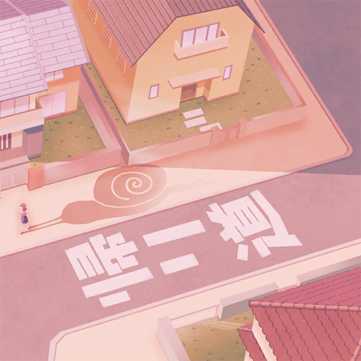
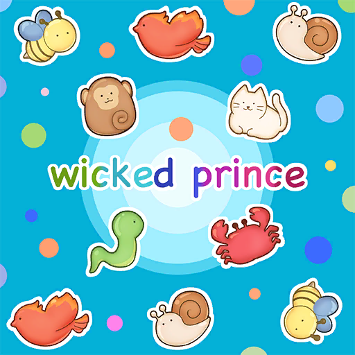
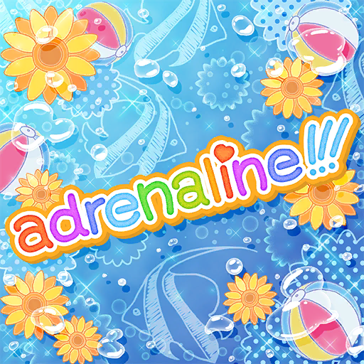
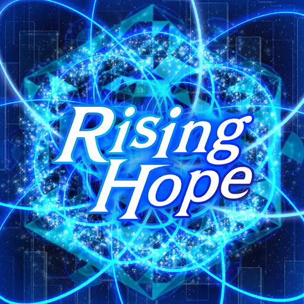

### 22/7 音楽の時間 Ongaku no Jikan - 翻唱歌曲 Cover Songs

<h5><a href="227%20Ongaku%20no%20Jikan.html">Back</a></h5>

<table>
<tr>
  <th><a href="#Monogatari_1">〈物語〉シリーズコラボイベント〈前編〉</a></th>
  <th><a href="#Monogatari_2">〈物語〉シリーズコラボイベント〈後編〉</a></th>
</tr>
<tr>
  <th><a href="#SUMMERSUMMERSUMMER_1">22/7×SUMMER×SUMMER×SUMMER! 前編</a></th>
  <th><a href="#SUMMERSUMMERSUMMER_3">22/7×SUMMER×SUMMER×SUMMER! 後編</a></th>
</tr>
<tr>
  <th><a href="#Princess_of_the_moon_night">稲穂に宿る月夜の姫</a></th>
  <th><a href="#Mahoka_Koko_no_Rettosei">魔法科高校の劣等生コラボイベント</a></th>
</tr>
<tr>
  <th><a href="#Helloween_GhostLoveSweet">とりっく・おあ・とりーと！～お菓子が好きなオバケの噂～</a></th>
  <th><a href="#IndivisibleBunkasai_MaidCafe">割り切れない文化祭　演劇メイド喫茶にようこそ！</a></th>
</tr>
<tr>
  <th><a href="#XmasNightTroubleGifts">聖なる夜のトラブルギフト</a></th>
  <th><a href="#LoveLikeValentine">Love Like Valentine</a></th>
</tr>
<tr>
  <th><a href="#DreamFrost_SatoReika">夢幻霜のシークエル case:佐藤麗華</a></th>
  <th><a href="#KinoNuketaCider_TripToKyoto">気の抜けたサイダー 古都へ行く。</a></th>
</tr>
<tr>
  <th><a href="#NanaNijiTheater_Stage1">ナナニジシアター Stage.01 なにわの探偵①</a></th>
  <th><a href="#NextStage_227noKiseki">Next stage ～ナナブンノニジュウニの軌跡～</a></th>
</tr>
<tr>
  <th><a href="#NanaNijiTheater_Stage1_2">ナナニジシアター Stage.01 なにわの探偵②</a></th>
</tr>
</table>

#### 22/7 音楽の時間  翻唱歌曲 Cover Songs
Date: 27May,2020  

**01. 青いスタスィオン** 
滝川みう（CV. 西條和） 
 
原唱: 河合その子 
 
<audio controls="controls">
  <source type="audio/mp3" src="../../Music/227%20Ongaku%20no%20Jikan/Cover%20Songs/01.%20青いスタスィオン.mp3"></source>
  
Your browser does not support the audio element.

</audio>

**02. 恋するフォーチュンクッキー** 
藤間桜（CV. 天城サリー） 
戸田ジュン（CV. 海乃るり） 
滝川みう（CV. 西條和） 
東条悠希（CV. 高辻麗） 
丸山あかね（CV. 白沢かなえ） 
 
原唱: AKB48 / AKB48第32張單曲 
 
<audio controls="controls">
  <source type="audio/mp3" src="../../Music/227%20Ongaku%20no%20Jikan/Cover%20Songs/02.%20恋するフォーチュンクッキー.mp3"></source>
  
Your browser does not support the audio element.

</audio>

**03. コネクト** 
河野都（CV. 倉岡水巴） 
戸田ジュン（CV. 海乃るり） 
 
原唱: ClariS / 《魔法少女小圓》OP 
 
<audio controls="controls">
  <source type="audio/mp3" src="../../Music/227%20Ongaku%20no%20Jikan/Cover%20Songs/03.%20コネクト.mp3"></source>
  
Your browser does not support the audio element.

</audio>

**04. 象さんのすきゃんてぃ** 
丸山あかね（CV. 白沢かなえ） 
立川絢香（CV. 宮瀬玲奈） 
 
原唱: うしろゆびさされ組 
 
<audio controls="controls">
  <source type="audio/mp3" src="../../Music/227%20Ongaku%20no%20Jikan/Cover%20Songs/04.%20象さんのすきゃんてぃ.mp3"></source>
  
Your browser does not support the audio element.

</audio>

**05. Preserved Roses** 
佐藤麗華（CV. 帆風千春） 
柊つぼみ（CV. 武田愛奈） 
 
原唱: T.M.Revolution×水樹奈々 / 《革命機Valvrave》第一季 OP 
 
<audio controls="controls">
  <source type="audio/mp3" src="../../Music/227%20Ongaku%20no%20Jikan/Cover%20Songs/05.%20Preserved%20Roses.mp3"></source>
  
Your browser does not support the audio element.

</audio>

**06. ヘビーローテーション** 
藤間桜（CV. 天城サリー） 
戸田ジュン（CV. 海乃るり） 
河野都（CV. 倉岡水巴） 
佐藤麗華（CV. 帆風千春） 
丸山あかね（CV. 白沢かなえ） 
 
原唱: AKB48 / AKB48第17張單曲 
 
<audio controls="controls">
  <source type="audio/mp3" src="../../Music/227%20Ongaku%20no%20Jikan/Cover%20Songs/06.%20ヘビーローテーション.mp3"></source>
  
Your browser does not support the audio element.

</audio>

**07. 時の河を越えて** 
神木みかみ（CV. 涼花萌） 
東条悠希（CV. 高辻麗） 
柊つぼみ（CV. 武田愛奈） 
 
原唱: うしろ髪ひかれ隊 
 
<audio controls="controls">
  <source type="audio/mp3" src="../../Music/227%20Ongaku%20no%20Jikan/Cover%20Songs/07.%20時の河を越えて.mp3"></source>
  
Your browser does not support the audio element.

</audio>

**08. 桃色タイフーン** 
東条悠希（CV. 高辻麗） 
 
原唱: 春奈るな / 《搖曳莊的幽奈小姐》OP 
 
<audio controls="controls">
  <source type="audio/mp3" src="../../Music/227%20Ongaku%20no%20Jikan/Cover%20Songs/08.%20桃色タイフーン.mp3"></source>
  
Your browser does not support the audio element.

</audio>

**09. IGNITE** 
佐藤麗華（CV. 帆風千春） 
 
原唱: 藍井エイル / 《刀劍神域Ⅱ》OP 
 
<audio controls="controls">
  <source type="audio/mp3" src="../../Music/227%20Ongaku%20no%20Jikan/Cover%20Songs/09.%20IGNITE.mp3"></source>
  
Your browser does not support the audio element.

</audio>

**10. 色彩** 
河野都（CV. 倉岡水巴） 
 
原唱: 坂本真綾 / 遊戲《Fate/Grand Order》主題曲 
 
<audio controls="controls">
  <source type="audio/mp3" src="../../Music/227%20Ongaku%20no%20Jikan/Cover%20Songs/10.%20色彩.mp3"></source>
  
Your browser does not support the audio element.

</audio>

**11. センチメンタルクライシス** 
戸田ジュン（CV. 海乃るり） 
 
原唱: halca / 《輝夜姬想讓人告白》第一季 ED 
 
<audio controls="controls">
  <source type="audio/mp3" src="../../Music/227%20Ongaku%20no%20Jikan/Cover%20Songs/11.%20センチメンタルクライシス.mp3"></source>
  
Your browser does not support the audio element.

</audio>

**12. 名前のない怪物** 
佐藤麗華（CV. 帆風千春） 
 
原唱: EGOIST / 《PSYCHO-PASS心靈判官》ED1 
 
<audio controls="controls">
  <source type="audio/mp3" src="../../Music/227%20Ongaku%20no%20Jikan/Cover%20Songs/12.%20名前のない怪物.mp3"></source>
  
Your browser does not support the audio element.

</audio>

**13. 桜、みんなで食べた** 
藤間桜（CV. 天城サリー） 
丸山あかね（CV. 白沢かなえ） 
立川絢香（CV. 宮瀬玲奈） 
河野都（CV. 倉岡水巴） 
東条悠希（CV. 高辻麗） 
 
原唱: HKT48 / HKT48第三張單曲 
 
<audio controls="controls">
  <source type="audio/mp3" src="../../Music/227%20Ongaku%20no%20Jikan/Cover%20Songs/13.%20桜、みんなで食べた.mp3"></source>
  
Your browser does not support the audio element.

</audio>

**14. oath sign** 
藤間桜（CV. 天城サリー） 
 
原唱: LiSA / 《Fate/Zero》第一季 OP 
 
<audio controls="controls">
  <source type="audio/mp3" src="../../Music/227%20Ongaku%20no%20Jikan/Cover%20Songs/14.%20oath%20sign.mp3"></source>
  
Your browser does not support the audio element.

</audio>

**15. ideal white** 
河野都（CV. 倉岡水巴） 
 
原唱: 綾野ましろ / 《Fate/stay night [Unlimited Blade Works]》OP1 
 
<audio controls="controls">
  <source type="audio/mp3" src="../../Music/227%20Ongaku%20no%20Jikan/Cover%20Songs/15.%20ideal%20white.mp3"></source>
  
Your browser does not support the audio element.

</audio>

**16. オーマイガー!** 
河野都（CV. 倉岡水巴） 
藤間桜（CV. 天城サリー） 
斎藤ニコル（CV. 河瀬詩） 
立川絢香（CV. 宮瀬玲奈） 
神木みかみ（CV. 涼花萌） 
 
原唱: NMB48 / NMB48第2張單曲 
 
<audio controls="controls">
  <source type="audio/mp3" src="../../Music/227%20Ongaku%20no%20Jikan/Cover%20Songs/16.%20オーマイガー!.mp3"></source>
  
Your browser does not support the audio element.

</audio>

**17. SPEED STAR** 
柊つぼみ（CV. 武田愛奈） 
 
原唱: GARNiDELiA / 《劇場版魔法科高中的劣等生 呼喚繁星的少女》OP 
 
<audio controls="controls">
  <source type="audio/mp3" src="../../Music/227%20Ongaku%20no%20Jikan/Cover%20Songs/17.%20SPEED%20STAR.mp3"></source>
  
Your browser does not support the audio element.

</audio>

**18. 走れ!ペンギン** 
佐藤麗華（CV. 帆風千春） 
神木みかみ（CV. 涼花萌） 
丸山あかね（CV. 白沢かなえ） 
柊つぼみ（CV. 武田愛奈） 
立川絢香（CV. 宮瀬玲奈） 
 
原唱: AKB48 
 
<audio controls="controls">
  <source type="audio/mp3" src="../../Music/227%20Ongaku%20no%20Jikan/Cover%20Songs/18.%20走れ!ペンギン.mp3"></source>
  
Your browser does not support the audio element.

</audio>

#### 〈物語〉シリーズコラボイベント〈前編〉
Date: 5Jun,2020  

**19. 君の知らない物語** 
佐藤麗華（CV. 帆風千春） 
 
原唱: nagi / 《化物語》ED 
 
<audio controls="controls">
  <source type="audio/mp3" src="../../Music/227%20Ongaku%20no%20Jikan/Cover%20Songs/19.%20君の知らない物語.mp3"></source>
  
Your browser does not support the audio element.

</audio>

**20. staple stable** 
滝川みう（CV. 西條和） 
 
原唱: 戦場ヶ原ひたぎ（斎藤千和）/ 《化物語》OP1 
 
<audio controls="controls">
  <source type="audio/mp3" src="../../Music/227%20Ongaku%20no%20Jikan/Cover%20Songs/20.%20staple%20stable.mp3"></source>
  
Your browser does not support the audio element.

</audio>

**21. 帰り道** 
藤間桜（CV. 天城サリー） 
 
原唱: 八九寺真宵（加藤英美里）/ 《化物語》OP2 
 
<audio controls="controls">
  <source type="audio/mp3" src="../../Music/227%20Ongaku%20no%20Jikan/Cover%20Songs/21.%20帰り道.mp3"></source>
  
Your browser does not support the audio element.

</audio>

**22. marshmallow justice** 
戸田ジュン（CV. 海乃るり） 
 
原唱: 阿良々木火憐（喜多村英梨）/ 《偽物語》OP2 
 
<audio controls="controls">
  <source type="audio/mp3" src="../../Music/227%20Ongaku%20no%20Jikan/Cover%20Songs/22.%20marshmallow%20justice.mp3"></source>
  
Your browser does not support the audio element.

</audio>

#### 〈物語〉シリーズコラボイベント〈後編〉
Date: 30Jun,2020  

**23. ambivalent world** 
河野都（CV. 倉岡水巴） 
 
原唱: 神原駿河（沢城みゆき）/ 《化物語》OP3 
 
<audio controls="controls">
  <source type="audio/mp3" src="../../Music/227%20Ongaku%20no%20Jikan/Cover%20Songs/23.%20ambivalent%20world.mp3"></source>
  
Your browser does not support the audio element.

</audio>

**24. 恋愛サーキュレーション** 
立川絢香（CV. 宮瀬玲奈） 
 
原唱: 千石撫子（花澤香菜）/ 《化物語》OP4 
 
<audio controls="controls">
  <source type="audio/mp3" src="../../Music/227%20Ongaku%20no%20Jikan/Cover%20Songs/24.%20恋愛サーキュレーション.mp3"></source>
  
Your browser does not support the audio element.

</audio>

**25. sugar sweet nightmare** 
丸山あかね（CV. 白沢かなえ） 
 
原唱: 羽川翼（堀江由衣）/ 《化物語》OP5 
 
<audio controls="controls">
  <source type="audio/mp3" src="../../Music/227%20Ongaku%20no%20Jikan/Cover%20Songs/25.%20sugar%20sweet%20nightmare.mp3"></source>
  
Your browser does not support the audio element.

</audio>

**26. 白金ディスコ** 
東条悠希（CV. 高辻麗） 
 
原唱: 阿良々木月火（井口裕香）/ 《偽物語》OP3 
 
<audio controls="controls">
  <source type="audio/mp3" src="../../Music/227%20Ongaku%20no%20Jikan/Cover%20Songs/26.%20白金ディスコ.mp3"></source>
  
Your browser does not support the audio element.

</audio>

**27. wicked prince** 
河野都（CV. 倉岡水巴） 
藤間桜（CV. 天城サリー） 
丸山あかね（CV. 白沢かなえ） 
滝川みう（CV. 西條和） 
立川絢香（CV. 宮瀬玲奈） 
 
原唱: princess à la mode / 手遊《物語系列 Puc Puc》OP 
 
<audio controls="controls">
  <source type="audio/mp3" src="../../Music/227%20Ongaku%20no%20Jikan/Cover%20Songs/27.%20wicked%20prince.mp3"></source>
  
Your browser does not support the audio element.

</audio>

#### 22/7×SUMMER×SUMMER×SUMMER! 前編
Date: 30Jul,2020

**28. Everyday、カチューシャ** 
佐藤麗華（CV. 帆風千春） 
滝川みう（CV. 西條和） 
斎藤ニコル（CV. 河瀬詩） 
立川絢香（CV. 宮瀬玲奈） 
柊つぼみ（CV. 武田愛奈） 
 
原唱: AKB48 / 電影《如果高校棒球女子經理讀了彼得·杜拉克》主題曲 
 
<audio controls="controls">
  <source type="audio/mp3" src="../../Music/227%20Ongaku%20no%20Jikan/Cover%20Songs/28.%20Everyday、カチューシャ.mp3"></source>
  
Your browser does not support the audio element.

</audio>

**29. ナギイチ** 
滝川みう（CV. 西條和） 
神木みかみ（CV. 涼花萌） 
立川絢香（CV. 宮瀬玲奈） 
戸田ジュン（CV. 海乃るり） 
河野都（CV. 倉岡水巴） 
 
原唱: NMB48 / NMB48第4張單曲 
 
<audio controls="controls">
  <source type="audio/mp3" src="../../Music/227%20Ongaku%20no%20Jikan/Cover%20Songs/29.%20ナギイチ.mp3"></source>
  
Your browser does not support the audio element.

</audio>

**30. パレオはエメラルド** 
斎藤ニコル（CV. 河瀬詩） 
神木みかみ（CV. 涼花萌） 
立川絢香（CV. 宮瀬玲奈） 
丸山あかね（CV. 白沢かなえ） 
東条悠希（CV. 高辻麗） 
藤間桜（CV. 天城サリー） 
 
原唱: SKE48 / SKE48第6張單曲 
 
<audio controls="controls">
  <source type="audio/mp3" src="../../Music/227%20Ongaku%20no%20Jikan/Cover%20Songs/30.%20パレオはエメラルド.mp3"></source>
  
Your browser does not support the audio element.

</audio>

#### 22/7×SUMMER×SUMMER×SUMMER! 後編
Date: 18Aug,2020

**31. motto☆派手にね！** 
神木みかみ（CV. 涼花萌） 
 
原唱: 戸松遥 / 《神薙》OP 
 
<audio controls="controls">
  <source type="audio/mp3" src="../../Music/227%20Ongaku%20no%20Jikan/Cover%20Songs/31.%20motto☆派手にね！.mp3"></source>
  
Your browser does not support the audio element.

</audio>

**32. Non stop road** 
戸田ジュン（CV. 海乃るり） 
滝川みう（CV. 西條和） 
斎藤ニコル（CV. 河瀬詩） 
立川絢香（CV. 宮瀬玲奈） 
 
原唱: sphere / 《夏色奇蹟》OP 
 
<audio controls="controls">
  <source type="audio/mp3" src="../../Music/227%20Ongaku%20no%20Jikan/Cover%20Songs/32.%20Non%20stop%20road.mp3"></source>
  
Your browser does not support the audio element.

</audio>

**33. adrenaline!!!** 
斎藤ニコル（CV. 河瀬詩） 
神木みかみ（CV. 涼花萌） 
戸田ジュン（CV. 海乃るり） 
 
原唱: TrySail / 《情色漫畫老師》ED 
 
<audio controls="controls">
  <source type="audio/mp3" src="../../Music/227%20Ongaku%20no%20Jikan/Cover%20Songs/33.%20adrenaline!!!.mp3"></source>
  
Your browser does not support the audio element.

</audio>

#### 稲穂に宿る月夜の姫
Date: 4Sep,2020

**34. 紅蓮華** 
佐藤麗華（CV. 帆風千春） 
 
原唱: LiSA / 《鬼滅之刃》OP 
 
<audio controls="controls">
  <source type="audio/mp3" src="../../Music/227%20Ongaku%20no%20Jikan/Cover%20Songs/34.%20紅蓮華.mp3"></source>
  
Your browser does not support the audio element.

</audio>

**35. from the edge** 
柊つぼみ（CV. 武田愛奈） 
 
原唱: FictionJunction feat.LiSA / 《鬼滅之刃》ED 
 
<audio controls="controls">
  <source type="audio/mp3" src="../../Music/227%20Ongaku%20no%20Jikan/Cover%20Songs/35.%20from%20the%20edge.mp3"></source>
  
Your browser does not support the audio element.

</audio>

#### 魔法科高校の劣等生コラボイベント
Date: 24Sep,2020

**36. Rising Hope** 
佐藤麗華（CV. 帆風千春） 
 
原唱: LiSA / 《魔法科高中的劣等生》OP1 
 
<audio controls="controls">
  <source type="audio/mp3" src="../../Music/227%20Ongaku%20no%20Jikan/Cover%20Songs/36.%20Rising%20Hope.mp3"></source>
  
Your browser does not support the audio element.

</audio>

**37. grilletto** 
東条悠希（CV. 高辻麗） 
 
原唱: GARNiDELiA / 《魔法科高中的劣等生》OP2 
 
<audio controls="controls">
  <source type="audio/mp3" src="../../Music/227%20Ongaku%20no%20Jikan/Cover%20Songs/37.%20grilletto.mp3"></source>
  
Your browser does not support the audio element.

</audio>

**38. ミレナリオ** 
滝川みう（CV. 西條和） 
 
原唱: ELISA / 《魔法科高中的劣等生》ED1 
 
<audio controls="controls">
  <source type="audio/mp3" src="../../Music/227%20Ongaku%20no%20Jikan/Cover%20Songs/38.%20ミレナリオ.mp3"></source>
  
Your browser does not support the audio element.

</audio>

**39. Mirror** 
藤間桜（CV. 天城サリー） 
 
原唱: 安田レイ / 《魔法科高中的劣等生》ED2 
 
<audio controls="controls">
  <source type="audio/mp3" src="../../Music/227%20Ongaku%20no%20Jikan/Cover%20Songs/39.%20Mirror.mp3"></source>
  
Your browser does not support the audio element.

</audio>

#### とりっく・おあ・とりーと！～お菓子が好きなオバケの噂～
Date: 20Oct,2020

**40. Magia** 
滝川みう（CV. 西條和） 
藤間桜（CV. 天城サリー） 
佐藤麗華（CV. 帆風千春） 
 
原唱: Kalafina / 《魔法少女小圓》ED 
 
<audio controls="controls">
  <source type="audio/mp3" src="../../Music/227%20Ongaku%20no%20Jikan/Cover%20Songs/40.%20Magia.mp3"></source>
  
Your browser does not support the audio element.

</audio>

**41. ゆずれない願い** 
河野都（CV. 倉岡水巴） 
 
原唱: 田村直美 / 《魔法騎士雷阿斯》OP 
 
<audio controls="controls">
  <source type="audio/mp3" src="../../Music/227%20Ongaku%20no%20Jikan/Cover%20Songs/41.%20ゆずれない願い.mp3"></source>
  
Your browser does not support the audio element.

</audio>

#### 割り切れない文化祭　演劇メイド喫茶にようこそ！
Date: 9Nov,2020

**42. フライングゲット** 
柊つぼみ（CV. 武田愛奈） 
斎藤ニコル（CV. 河瀬詩） 
東条悠希（CV. 高辻麗） 
滝川みう（CV. 西條和） 
佐藤麗華（CV. 帆風千春） 
 
原唱: AKB48 / AKB48第22張單曲 
 
<audio controls="controls">
  <source type="audio/mp3" src="../../Music/227%20Ongaku%20no%20Jikan/Cover%20Songs/42.%20フライングゲット.mp3"></source>
  
Your browser does not support the audio element.

</audio>

**43. 言い訳Maybe** 
斎藤ニコル（CV. 河瀬詩） 
戸田ジュン（CV. 海乃るり） 
東条悠希（CV. 高辻麗） 
神木みかみ（CV. 涼花萌） 
河野都（CV. 倉岡水巴） 
 
原唱: AKB48 / AKB48第13張單曲 
 
<audio controls="controls">
  <source type="audio/mp3" src="../../Music/227%20Ongaku%20no%20Jikan/Cover%20Songs/43.%20言い訳Maybe.mp3"></source>
  
Your browser does not support the audio element.

</audio>

**44. ギンガムチェック** 
丸山あかね（CV. 白沢かなえ） 
神木みかみ（CV. 涼花萌） 
柊つぼみ（CV. 武田愛奈） 
戸田ジュン（CV. 海乃るり） 
藤間桜（CV. 天城サリー） 
 
原唱: AKB48 / AKB48第27張單曲 
 
<audio controls="controls">
  <source type="audio/mp3" src="../../Music/227%20Ongaku%20no%20Jikan/Cover%20Songs/44.%20ギンガムチェック.mp3"></source>
  
Your browser does not support the audio element.

</audio>

#### 聖なる夜のトラブルギフト
Date: 17Dec,2020

**45. チカっとチカ千花っ♡** 
藤間桜（CV. 天城サリー） 
 
原唱: 藤原千花（小原好美）/ 《輝夜姬想讓人告白》第一季 插入曲 
 
<audio controls="controls">
  <source type="audio/mp3" src="../../Music/227%20Ongaku%20no%20Jikan/Cover%20Songs/45.%20チカっとチカ千花っ♡.mp3"></source>
  
Your browser does not support the audio element.

</audio>

#### Love Like Valentine
Date: 1Feb,2021

**46. バレンタイン・キッス** 
斎藤ニコル（CV. 河瀬詩） 
 
原唱: 国生さゆり 
 
<audio controls="controls">
  <source type="audio/mp3" src="../../Music/227%20Ongaku%20no%20Jikan/Cover%20Songs/46.%20バレンタイン・キッス.mp3"></source>
  
Your browser does not support the audio element.

</audio>

**47. EQUALロマンス** 
神木みかみ（CV. 涼花萌） 
河野都（CV. 倉岡水巴） 
滝川みう（CV. 西條和） 
戸田ジュン（CV. 海乃るり） 
丸山あかね（CV. 白沢かなえ） 
 
原唱: CoCo / 《亂馬½》ED2 
 
<audio controls="controls">
  <source type="audio/mp3" src="../../Music/227%20Ongaku%20no%20Jikan/Cover%20Songs/47.%20EQUALロマンス.mp3"></source>
  
Your browser does not support the audio element.

</audio>

#### 夢幻霜のシークエル case:佐藤麗華
Date: 26Feb,2021

**48. 逆光** 
佐藤麗華（CV. 帆風千春） 
 
原唱: 坂本真綾 / 遊戲《Fate/Grand Order》第2部主題曲 
 
<audio controls="controls">
  <source type="audio/mp3" src="../../Music/227%20Ongaku%20no%20Jikan/Cover%20Songs/48.%20逆光.mp3"></source>
  
Your browser does not support the audio element.

</audio>

#### 気の抜けたサイダー 古都へ行く。
Date: 31Mar,2021

**49. sweets parade** 
神木みかみ（CV. 涼花萌） 
滝川みう（CV. 西條和） 
藤間桜（CV. 天城サリー） 
 
原唱: 髏々宮カルタ（花澤香菜）/ 《妖狐×僕SS》ED5 
 
<audio controls="controls">
  <source type="audio/mp3" src="../../Music/227%20Ongaku%20no%20Jikan/Cover%20Songs/49.%20sweets%20parade.mp3"></source>
  
Your browser does not support the audio element.

</audio>

#### ナナニジシアター Stage.01 なにわの探偵①
Date: 14May,2021

**50. SOMEONE ELSE** 
河野都（CV. 倉岡水巴） 
東条悠希（CV. 高辻麗） 
戸田ジュン（CV. 海乃るり） 
 
原唱: 種島ぽぷら（阿澄佳奈）、伊波まひる（藤田咲）、轟八千代（喜多村英梨）/ 《WORKING!!》OP 
 
<audio controls="controls">
  <source type="audio/mp3" src="../../Music/227%20Ongaku%20no%20Jikan/Cover%20Songs/50.%20SOMEONE%20ELSE.mp3"></source>
  
Your browser does not support the audio element.

</audio>

#### Next stage ～ナナブンノニジュウニの軌跡～
Date: 26May,2021

**51. 怪物** 
東条悠希（CV. 高辻麗） 
 
原唱: YOASOBI / 《BEASTARS》OP2 
 
<audio controls="controls">
  <source type="audio/mp3" src="../../Music/227%20Ongaku%20no%20Jikan/Cover%20Songs/51.%20怪物.mp3"></source>
  
Your browser does not support the audio element.

</audio>

Date: 2Jun,2021

**52. 夜に駆ける** 
藤間桜（CV. 天城サリー） 
 
原唱: YOASOBI / YOASOBI第一首單曲 
 
<audio controls="controls">
  <source type="audio/mp3" src="../../Music/227%20Ongaku%20no%20Jikan/Cover%20Songs/52.%20夜に駆ける.mp3"></source>
  
Your browser does not support the audio element.

</audio>

**53. 群青** 
滝川みう（CV. 西條和） 
Chorus: 22/7 
 
原唱: YOASOBI / YOASOBI第五首單曲 
 
<audio controls="controls">
  <source type="audio/mp3" src="../../Music/227%20Ongaku%20no%20Jikan/Cover%20Songs/53.%20群青.mp3"></source>
  
Your browser does not support the audio element.

</audio>

#### ナナニジシアター Stage.01 なにわの探偵②
Date: 9Jun,2021

**54. 不可思議のカルテ** 
丸山あかね（CV. 白沢かなえ） 
 
原唱: 桜島麻衣（瀬戸麻沙美）、古賀朋絵（東山奈央）、双葉理央（種﨑敦美）、豊浜のどか（内田真礼）、梓川かえで（久保ユリカ）、牧之原翔子（水瀬いのり） / 《青春豬頭少年不會夢到兔女郎學姊》ED 
 
<audio controls="controls">
  <source type="audio/mp3" src="../../Music/227%20Ongaku%20no%20Jikan/Cover%20Songs/54.%20不可思議のカルテ.mp3"></source>
  
Your browser does not support the audio element.

</audio>