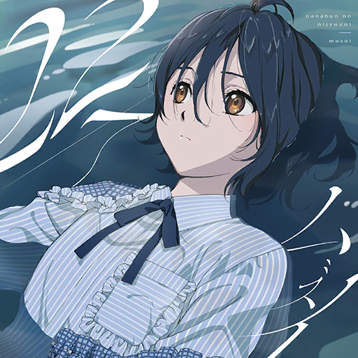
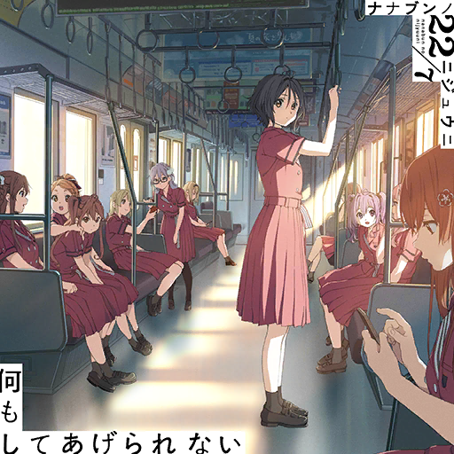
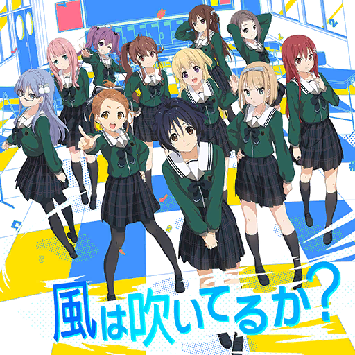

### 22/7 音楽の時間 Ongaku no Jikan - 原創歌曲 Original Songs
##### [Back](227%20Ongaku%20no%20Jikan.html)

<table>
<tr>
  <th><a href="#single">單曲 Single</a></th>
  <th><a href="#digital_single">數位單曲 Digital Single</a></th>
</tr>
<tr>
  <th><a href="#character_songs">角色歌 Character Songs</a></th>
</tr>
</table>

#### 單曲 Single 

6th Single

5th Single
**ムズイ**  
 
<audio controls="controls">
  <source type="audio/mp3" src="../../Music/227%20Ongaku%20no%20Jikan/Original%20Songs/ムズイ.mp3"></source>
  
Your browser does not support the audio element.

</audio>

4th Single
**何もしてあげられない**  
 
<audio controls="controls">
  <source type="audio/mp3" src="../../Music/227%20Ongaku%20no%20Jikan/Original%20Songs/何もしてあげられない.mp3"></source>
  
Your browser does not support the audio element.

</audio>

3rd Single

2nd Single

Debut Single

#### 數位單曲 Digital Single 

**風は吹いてるか?**  
 
<audio controls="controls">
  <source type="audio/mp3" src="../../Music/227%20Ongaku%20no%20Jikan/Original%20Songs/風は吹いてるか_.mp3"></source>
  
Your browser does not support the audio element.

</audio>

#### 角色歌 Character Songs 

**風は吹いてるか?**  
 
<audio controls="controls">
  <source type="audio/mp3" src="../../Music/227%20Ongaku%20no%20Jikan/Original%20Songs/風は吹いてるか_.mp3"></source>
  
Your browser does not support the audio element.

</audio>
