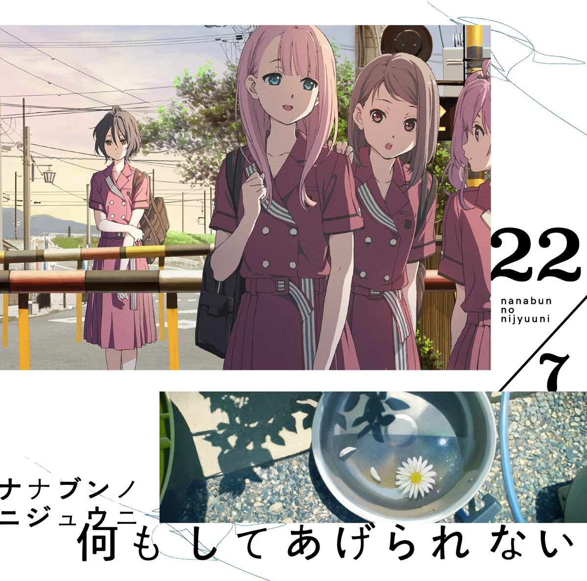

### 何もしてあげられない Nani Mo Shiteagerarenai
##### [Back](Music_List.md)

#### 何もしてあげられない【初回仕様限定盤Type-A】
 
Date: 21Aug,2019 
<blockquote>
1.何もしてあげられない 
2.君はMoon 
3.とんぼの気持ち 
4.何もしてあげられない -off vocal ver.- 
5.君はMoon -off vocal ver.- 
6.とんぼの気持ち -off vocal ver.- 
</blockquote> 

#### 何もしてあげられない【初回仕様限定盤Type-B】
 
Date: 21Aug,2019 
<blockquote>
1.何もしてあげられない 
2.君はMoon 
3.ロマンスの積み木 
4.何もしてあげられない -off vocal ver.- 
5.君はMoon -off vocal ver.- 
6.ロマンスの積み木 -off vocal ver.- 
</blockquote> 

#### 何もしてあげられない【通常盤】
 
Date: 21Aug,2019 
<blockquote>
1.何もしてあげられない 
2.君はMoon 
3.Rain of lies 
4.何もしてあげられない -off vocal ver.- 
5.君はMoon -off vocal ver.- 
6.Rain of lies -off vocal ver.- 
</blockquote> 

試聽 Preview 

**01. 何もしてあげられない** 
<audio controls="controls">
  <source type="audio/mp3" src="../../Music/04_Nani%20Mo%20Shiteagerarenai/01.%20何もしてあげられない.mp3"></source>
  
Your browser does not support the audio element.

</audio>

**02. 君はMoon** 
<audio controls="controls">
  <source type="audio/mp3" src="../../Music/04_Nani%20Mo%20Shiteagerarenai/02.%20君はMoon.mp3"></source>
  
Your browser does not support the audio element.

</audio>

**03. とんぼの気持ち** 
<audio controls="controls">
  <source type="audio/mp3" src="../../Music/04_Nani%20Mo%20Shiteagerarenai/03.%20とんぼの気持ち.mp3"></source>
  
Your browser does not support the audio element.

</audio>

**03. ロマンスの積み木** 
<audio controls="controls">
  <source type="audio/mp3" src="../../Music/04_Nani%20Mo%20Shiteagerarenai/03.%20ロマンスの積み木.mp3"></source>
  
Your browser does not support the audio element.

</audio>

**03. Rain of lies** 
<audio controls="controls">
  <source type="audio/mp3" src="../../Music/04_Nani%20Mo%20Shiteagerarenai/03.%20Rain%20of%20lies.mp3"></source>
  
Your browser does not support the audio element.

</audio>

**04. 何もしてあげられない -off vocal ver.-** 
<audio controls="controls">
  <source type="audio/mp3" src="../../Music/04_Nani%20Mo%20Shiteagerarenai/04.%20何もしてあげられない%20-off%20vocal%20ver.-.mp3"></source>
  
Your browser does not support the audio element.

</audio>

**05. 君はMoon -off vocal ver.-** 
<audio controls="controls">
  <source type="audio/mp3" src="../../Music/04_Nani%20Mo%20Shiteagerarenai/05.%20君はMoon%20-off%20vocal%20ver.-.mp3"></source>
  
Your browser does not support the audio element.

</audio>

**06. とんぼの気持ち -off vocal ver.-** 
<audio controls="controls">
  <source type="audio/mp3" src="../../Music/04_Nani%20Mo%20Shiteagerarenai/Off%20Vocal%20(Type%20A)/06.%20とんぼの気持ち%20-off%20vocal%20ver.-.mp3"></source>
  
Your browser does not support the audio element.

</audio>

**06. ロマンスの積み木 -off vocal ver.-** 
<audio controls="controls">
  <source type="audio/mp3" src="../../Music/04_Nani%20Mo%20Shiteagerarenai/Off%20Vocal%20(Type%20B)/06.%20ロマンスの積み木%20-off%20vocal%20ver.-.mp3"></source>
  
Your browser does not support the audio element.

</audio>

**06. Rain of lies -off vocal ver.-** 
<audio controls="controls">
  <source type="audio/mp3" src="../../Music/04_Nani%20Mo%20Shiteagerarenai/Off%20Vocal%20(Regular)/06.%20Rain%20of%20lies%20-off%20vocal%20ver.-.mp3"></source>
  
Your browser does not support the audio element.

</audio>