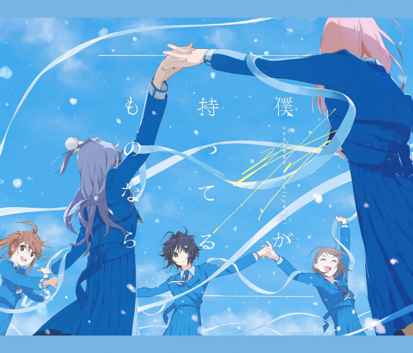

### 僕が持ってるものなら Boku ga Motteru Mono Nara
##### [Back](Music_List.md)

#### 僕が持ってるものなら【完全生産限定盤】
 
Date: 24Feb,2021 

<blockquote>
1. 僕が持ってるものなら 
2. タチツテトパワー 
3. 好きと言ったのは嘘だ 
4. 僕が持ってるものなら -off vocal ver.- 
5. タチツテトパワー -off vocal ver.- 
6. 好きと言ったのは嘘だ -off vocal ver.- 
</blockquote>
 

#### 僕が持ってるものなら【初回生産限定盤】
 
Date: 24Feb,2021 

<blockquote>
1. 僕が持ってるものなら 
2. タチツテトパワー 
3. キウイの主張 
4. 僕が持ってるものなら -off vocal ver.- 
5. タチツテトパワー -off vocal ver.- 
6. キウイの主張 -off vocal ver.- 
</blockquote>
 

#### 僕が持ってるものなら【通常盤】
 
Date: 24Feb,2021 

<blockquote>
1. 僕が持ってるものなら 
2. タチツテトパワー 
3. 雷鳴のDelay 
4. 僕が持ってるものなら -off vocal ver.- 
5. タチツテトパワー -off vocal ver.- 
6. 雷鳴のDelay -off vocal ver.- 
</blockquote>
 

試聽 Preview 

**01. 僕が持ってるものなら** 
<audio controls="controls">
  <source type="audio/mp3" src="../../Music/07_Boku%20ga%20Motteru%20Mono%20Nara/01.%20僕が持ってるものなら.mp3"></source>
  
Your browser does not support the audio element.

</audio>

**02. タチツテトパワー** 
<audio controls="controls">
  <source type="audio/mp3" src="../../Music/07_Boku%20ga%20Motteru%20Mono%20Nara/02.%20タチツテトパワー.mp3"></source>
  
Your browser does not support the audio element.

</audio>

**03. 好きと言ったのは嘘だ** ^Currently Unavailable 
<audio controls="controls">
  <source type="audio/mp3" src="../../Music/07_Boku%20ga%20Motteru%20Mono%20Nara/03.%20好きと言ったのは嘘だ.mp3"></source>
  
Your browser does not support the audio element.

</audio>

**03. キウイの主張** 
<audio controls="controls">
  <source type="audio/mp3" src="../../Music/07_Boku%20ga%20Motteru%20Mono%20Nara/03.%20キウイの主張.mp3"></source>
  
Your browser does not support the audio element.

</audio>

**03. 雷鳴のDelay** ^Currently Unavailable 
<audio controls="controls">
  <source type="audio/mp3" src="../../Music/07_Boku%20ga%20Motteru%20Mono%20Nara/03.%20雷鳴のDelay.mp3"></source>
  
Your browser does not support the audio element.

</audio>

**04. 僕が持ってるものなら -off vocal ver.-** 
<audio controls="controls">
  <source type="audio/mp3" src="../../Music/07_Boku%20ga%20Motteru%20Mono%20Nara/04.%20僕が持ってるものなら%20-off%20vocal%20ver.-.mp3"></source>
  
Your browser does not support the audio element.

</audio>

**05. タチツテトパワー -off vocal ver.-** 
<audio controls="controls">
  <source type="audio/mp3" src="../../Music/07_Boku%20ga%20Motteru%20Mono%20Nara/05.%20タチツテトパワー%20-off%20vocal%20ver.-.mp3"></source>
  
Your browser does not support the audio element.

</audio>

**06. 好きと言ったのは嘘だ -off vocal ver.-** ^Currently Unavailable 
<audio controls="controls">
  <source type="audio/mp3" src="../../Music/07_Boku%20ga%20Motteru%20Mono%20Nara/Off%20Vocal%20(Complete%20Edition)/06.%20好きと言ったのは嘘だ%20-off%20vocal%20ver.-.mp3"></source>
  
Your browser does not support the audio element.

</audio>

**06. キウイの主張 -off vocal ver.-** 
<audio controls="controls">
  <source type="audio/mp3" src="../../Music/07_Boku%20ga%20Motteru%20Mono%20Nara/Off%20Vocal%20(Limited%20Edition)/06.%20キウイの主張%20-off%20vocal%20ver.-.mp3"></source>
  
Your browser does not support the audio element.

</audio>

**06. 雷鳴のDelay -off vocal ver.-** ^Currently Unavailable 
<audio controls="controls">
  <source type="audio/mp3" src="../../Music/07_Boku%20ga%20Motteru%20Mono%20Nara/Off%20Vocal%20(Regular)/06.%20雷鳴のDelay%20-off%20vocal%20ver.-.mp3"></source>
  
Your browser does not support the audio element.

</audio>
