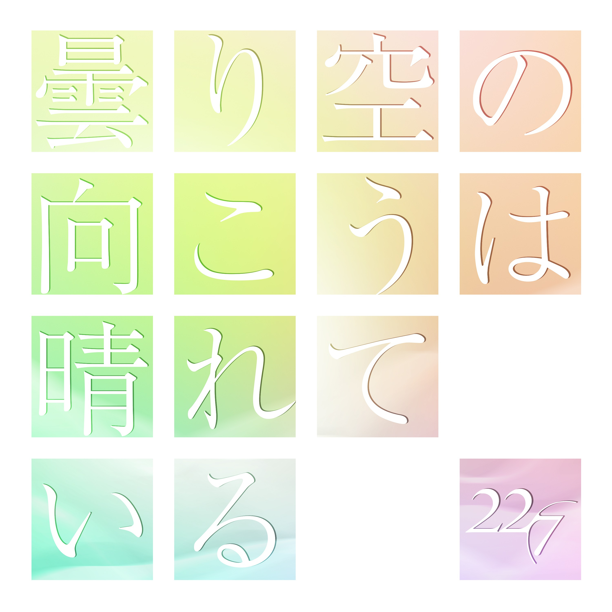

### 曇り空の向こうは晴れている Kumorizora no Muko wa Hareteiru
##### [Back](Music_List.md)

#### 曇り空の向こうは晴れている【完全生産限定盤A】
 
Date: 27Jul,2022 

<blockquote>
1. 曇り空の向こうは晴れている 
2. 打ち上げ花火の拒否権 
3. 君は誰だ？/晴れた日のベンチ 
4. 曇り空の向こうは晴れている -off vocal ver.- 
5. 打ち上げ花火の拒否権 -off vocal ver.- 
6. 君は誰だ？ -off vocal ver.- 
</blockquote>
 

#### 曇り空の向こうは晴れている【完全生産限定盤B】
 
Date: 27Jul,2022 

<blockquote>
1. 曇り空の向こうは晴れている 
2. 打ち上げ花火の拒否権 
3. 君は誰だ？/晴れた日のベンチ 
4. 曇り空の向こうは晴れている -off vocal ver.- 
5. 打ち上げ花火の拒否権 -off vocal ver.- 
6. 君は誰だ？ -off vocal ver.- 
</blockquote>
 

#### 曇り空の向こうは晴れている【初回生産限定盤】
 
Date: 27Jul,2022 

<blockquote>
1. 曇り空の向こうは晴れている 
2. 打ち上げ花火の拒否権 
3. カントリーガール/気の抜けたサイダー 
4. 曇り空の向こうは晴れている -off vocal ver.- 
5. 打ち上げ花火の拒否権 -off vocal ver.- 
6. カントリーガール –off vocal ver.- 
</blockquote>
 

#### 曇り空の向こうは晴れている【通常盤】
 
Date: 27Jul,2022 

<blockquote>
1. 曇り空の向こうは晴れている 
2. 打ち上げ花火の拒否権 
3. 読みかけの漫画/蛍光灯再生計画 
4. 曇り空の向こうは晴れている -off vocal ver.- 
5. 打ち上げ花火の拒否権 -off vocal ver.- 
6. 読みかけの漫画 –off vocal ver.- 
</blockquote>
 

#### 曇り空の向こうは晴れている 先行配信
 
Date: 20Jun,2021 

<blockquote>
1. 曇り空の向こうは晴れている 
2. 曇り空の向こうは晴れている (Instrumental) 
</blockquote>
 

試聽 Preview 

**01. 曇り空の向こうは晴れている** 
<audio controls="controls">
  <source type="audio/mp3" src="../../Music/09_Kumorizora%20no%20Muko%20wa%20Hareteiru/01.%20曇り空の向こうは晴れている.mp3"></source>
  
Your browser does not support the audio element.

</audio>

**02. 打ち上げ花火の拒否権** 
<audio controls="controls">
  <source type="audio/mp3" src="../../Music/09_Kumorizora%20no%20Muko%20wa%20Hareteiru/02.%20打ち上げ花火の拒否権.mp3"></source>
  
Your browser does not support the audio element.

</audio>

**03. 君は誰だ？** 
<audio controls="controls">
  <source type="audio/mp3" src="../../Music/09_Kumorizora%20no%20Muko%20wa%20Hareteiru/03.%20君は誰だ？.mp3"></source>
  
Your browser does not support the audio element.

</audio>

**03. カントリーガール** 
<audio controls="controls">
  <source type="audio/mp3" src="../../Music/09_Kumorizora%20no%20Muko%20wa%20Hareteiru/04.%20カントリーガール.mp3"></source>
  
Your browser does not support the audio element.

</audio>

**03. 読みかけの漫画** 
<audio controls="controls">
  <source type="audio/mp3" src="../../Music/09_Kumorizora%20no%20Muko%20wa%20Hareteiru/05.%20読みかけの漫画.mp3"></source>
  
Your browser does not support the audio element.

</audio>

**04. 曇り空の向こうは晴れている -off vocal ver.-** ^Currently Unavailable 
<audio controls="controls">
  <source type="audio/mp3" src="../../Music/09_Kumorizora%20no%20Muko%20wa%20Hareteiru/04.%20曇り空の向こうは晴れている%20-off%20vocal%20ver.-.mp3"></source>
  
Your browser does not support the audio element.

</audio>

**05. 打ち上げ花火の拒否権 -off vocal ver.-** ^Currently Unavailable 
<audio controls="controls">
  <source type="audio/mp3" src="../../Music/09_Kumorizora%20no%20Muko%20wa%20Hareteiru/05.%20打ち上げ花火の拒否権%20-off%20vocal%20ver.-.mp3"></source>
  
Your browser does not support the audio element.

</audio>

**06. 君は誰だ？ -off vocal ver.-** ^Currently Unavailable 
<audio controls="controls">
  <source type="audio/mp3" src="../../Music/09_Kumorizora%20no%20Muko%20wa%20Hareteiru/06.%20君は誰だ？%20-off%20vocal%20ver.-.mp3"></source>
  
Your browser does not support the audio element.

</audio>

**06. カントリーガール -off vocal ver.-** ^Currently Unavailable 
<audio controls="controls">
  <source type="audio/mp3" src="../../Music/09_Kumorizora%20no%20Muko%20wa%20Hareteiru/06.%20カントリーガール%20-off%20vocal%20ver.-.mp3"></source>
  
Your browser does not support the audio element.

</audio>

**06. 読みかけの漫画 -off vocal ver.-** ^Currently Unavailable 
<audio controls="controls">
  <source type="audio/mp3" src="../../Music/09_Kumorizora%20no%20Muko%20wa%20Hareteiru/06.%20読みかけの漫画%20-off%20vocal%20ver.-.mp3"></source>
  
Your browser does not support the audio element.

</audio>

先行配信 
**01. 曇り空の向こうは晴れている** 
<audio controls="controls">
  <source type="audio/mp3" src="../../Music/09_Kumorizora%20no%20Muko%20wa%20Hareteiru/先行配信/01.%20曇り空の向こうは晴れている.flac"></source>
  
Your browser does not support the audio element.

</audio>

**02. 曇り空の向こうは晴れている (Instrumental)** 
<audio controls="controls">
  <source type="audio/mp3" src="../../Music/09_Kumorizora%20no%20Muko%20wa%20Hareteiru/先行配信/02.%20曇り空の向こうは晴れている%20(Instrumental).flac"></source>
  
Your browser does not support the audio element.

</audio>
