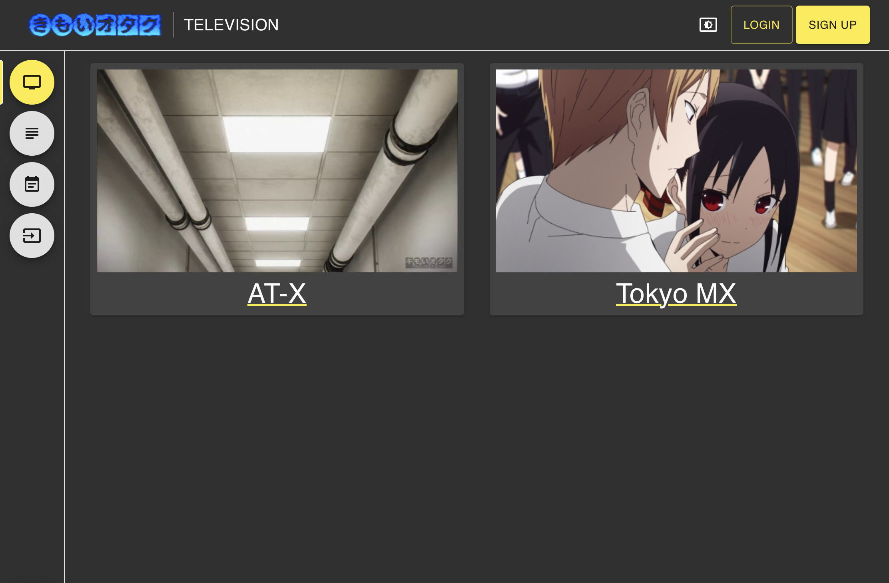
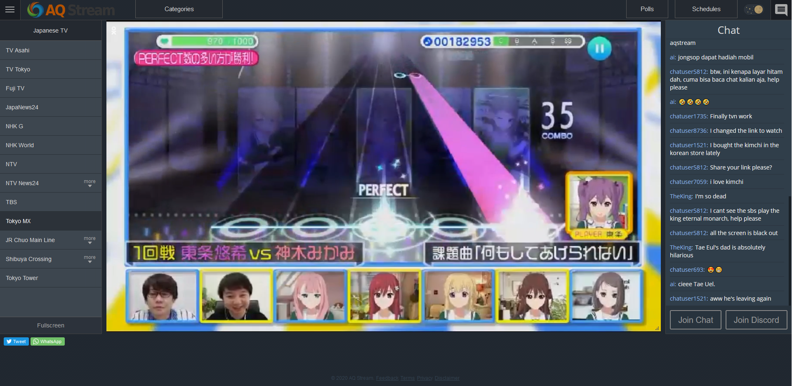
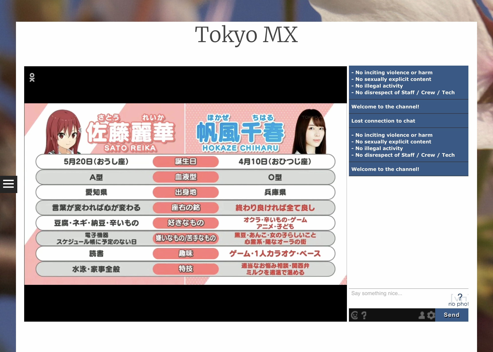
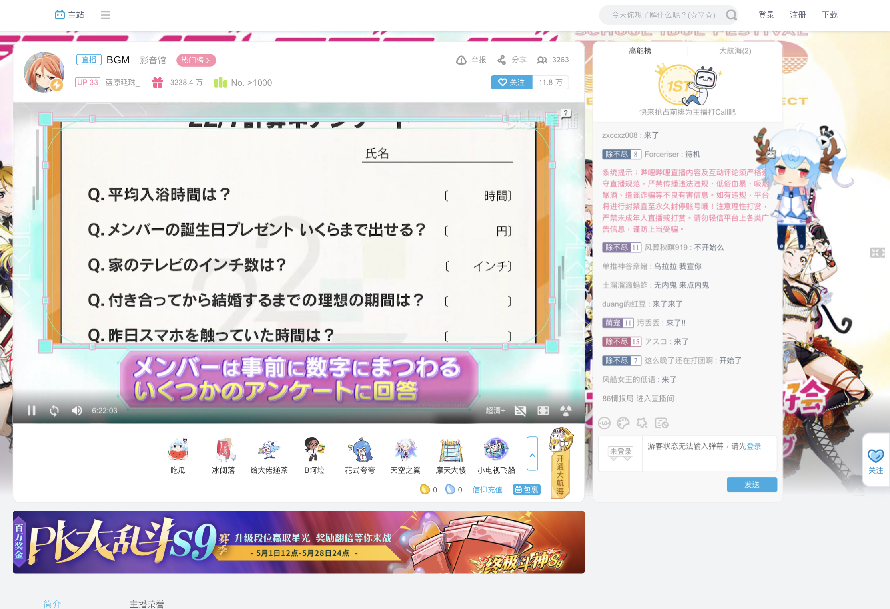

### 直播源 Live Stream
##### [Back](../readme.md)

#### Tokyo MX
<!--
- <a target="_blank" rel="noopener noreferrer" href="http://dsgstng.herokuapp.com/tv">Dテレ</a> 

-->
- <a target="_blank" rel="noopener noreferrer" href="https://aqstream.com/jp/tmx/Tokyo-MX">Aqstream</a> 

- <a target="_blank" rel="noopener noreferrer" href="http://mov3.co/tokyomx/">mov3 日本電視台</a> 

- ok.ru 

<!--
エムキャス MX CASTING (1280x720): http://movie.mcas.jp/mcas/mx1_2/chunklist.m3u8 
us195 (960x540) : https://cdn.us195.jpnettv.live/jptv/kanto_tokyo_mx1_540/playlist.m3u8 
jpth10 (960x540) : https://cdn.jpth10.jpnettv.live/jptv/kanto_tokyo_mx1_540/playlist.m3u8 
2103 (640x360) : http://redlabmcdn.s.llnwi.net/jp01/ryowa8/index.m3u8 
2108 (960x540) : http://1.179.247.11:1935/jptv/kanto_tokyo_mx1_540/playlist.m3u8

  <video width="70%" height="70%" id="my_video_1" class="video-js vjs-fluid vjs-default-skin" controls preload="auto"  data-setup='{}'>
    <source src="" type="application/x-mpegURL">
  
Your browser does not support this HLS element.

  </video>

-->

<iframe src="//ok.ru/videoembed/3176970985207" scrolling="no" frameborder="0" width="70%" height="70%" allowfullscreen="true" webkitallowfullscreen="true" mozallowfullscreen="true"></iframe>

<a target="_blank" rel="noopener noreferrer" href="https://s.mxtv.jp/bangumi/">Tokyo MX 番組表</a>

#### BS11
- <a target="_blank" rel="noopener noreferrer" href="https://live.bilibili.com/10112">Bilibili Live</a> 

<iframe style="width: 70%;height: 70%;" src="https://www.bilibili.com/blackboard/live/live-activity-player.html?cid=10112&quality=1" frameborder="no"    framespacing="0" scrolling="no" allow="encrypted-media" allowfullscreen="true"></iframe>

<a target="_blank" rel="noopener noreferrer" href="https://www.bs11.jp/program/">BS11 番組表</a>

<h4><a target="_blank" rel="noopener noreferrer" href="https://www.uniqueradio.jp/agplayer5/player.php">超！A＆G+</a></h4>

  <video width="70%" height="70%" id="my_video_1" class="video-js vjs-fluid vjs-default-skin" controls preload="auto"  data-setup='{}'>
    <source src="https://fms2.uniqueradio.jp/agqr10/aandg1.m3u8" type="application/x-mpegURL">
  
Your browser does not support this HLS element.

  </video>
  

<a target="_blank" rel="noopener noreferrer" href="https://www.agqr.jp/timetable/streaming.html">超！A&G+ 番組表</a>

<!--
http://www.uniqueradio.jp/agplayerf/hls/Active.m3u8
-->
