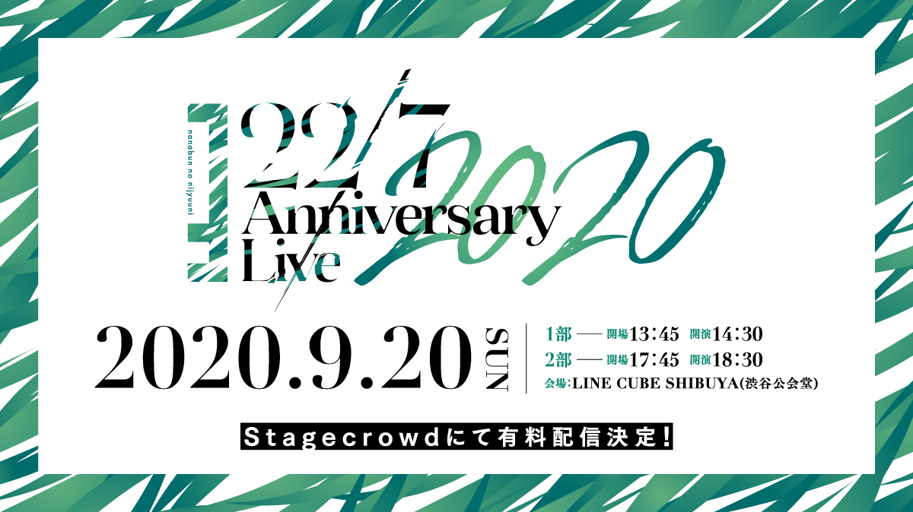

### 22/7 Anniversary Live 2020
##### [Back](../Live_List.md)

  
Date: 20Sep,2020  

<a target="_blank" rel="noopener noreferrer" href="https://www.nanabunnonijyuuni.com/sp/news/archive/?522128">Official New</a>

<b>^ The footages will release after 6 months, which is on 20Mar,2021.</b> 

><公演情報>  
22/7 『Anniversary Live 2020』   
【日程・時間】  
昼公演  
2020年9月20日(日)  
開場 （配信開始）13：45 / 開演 14：30（ライブ開始）   
夜公演  
2020年9月20日(日)  
開場（配信開始） 17：45 / 開演 18：30（ライブ開始）   
【料金】 
一般視聴チケット:3,000円(税込) 
ファンクラブ限定チケット：4,000円(税込) ※ファンクラブ限定チケットご購入の方は、アフタートークもご覧いただけます。   
【配信メディア】 Stagecrowd：https://stagecrowd.live/s/live000/?ima=2920 
【チケットご購入はこちら】販売日：9月1日(火) 21:00～ https://nanabunnonijyuuni-mobile.com/6558996132/

>日場： 
表演曲目 Setlist 
Opening 
1.君はMoon 
2.叫ぶしかない青春 
MC 
3.ムズイ 
4.理解者 
5.地下鉄抵抗主義 
6.願いの眼差し 
7.循環バス 
MC 
8.半チャーハン 
9.タトゥー・ラブ 
10.ソフトクリーム落としちゃった 
MC 
11.ポニーテールは振り向かせない 
12.未来があるから 
13.ロマンスの積み木 
14.風は吹いてるか？ 
Encore 
15.何もしてあげられない 
MC 
16.韋駄天娘

Live
<video width="100%" height="100%" controls>
  <source src="https://github.com/LYHPandaKing/227PhotoBackup/releases/download/227_Live/https://github.com/LYHPandaKing/227PhotoBackup/releases/download/227_Live/20200920_22_7.Anniversary.Live.2020-DayLive" type="video/mp4">
</video>

Live w/ FC Talk
<video width="100%" height="100%" controls>
  <source src="https://github.com/LYHPandaKing/227PhotoBackup/releases/download/227_Live/https://github.com/LYHPandaKing/227PhotoBackup/releases/download/227_Live/20200920_22_7.Anniversary.Live.2020-DayLive_FCVer" type="video/mp4">
</video>

FC Talk
<video width="100%" height="100%" controls>
  <source src="https://github.com/LYHPandaKing/227PhotoBackup/releases/download/227_Live/https://github.com/LYHPandaKing/227PhotoBackup/releases/download/227_Live/20200920_22_7.Anniversary.Live.2020.DayFCTalk" type="video/mp4">
</video>

<table>
<tr>
 <th rowspan="3">Raw</th>
 <th>Live</th>
 <th><a target="_blank" rel="noopener noreferrer" href="https://nanabunnonijyuuni-mobile.com/s/live040/page/Day-Player?ima=1928">Source</a></th>
</tr>
<tr>
 <th>Live w/ FC Talk</th>
 <th><a target="_blank" rel="noopener noreferrer" href="https://www.bilibili.com/video/BV1N5411j7dc">Source</a></th>
</tr>
<tr>
 <th>FC Talk</th>
 <th><a target="_blank" rel="noopener noreferrer" href="https://www.bilibili.com/video/BV1s54y1m7uP">Source</a></th>
</tr>
<tr>
 <th rowspan="3">Sub</th>
 <th>Live</th>
 <th>Currently Unavailable</th>
</tr>
<tr>
 <th>Live w/ FC Talk</th>
 <th>Currently Unavailable</th>
</tr>
<tr>
 <th>FC Talk</th>
 <th>Currently Unavailable</th>
</tr>
</table>

>夜場： 
表演曲目 Setlist 
Opening 
1.Rain of lies 
2.不確かな青春 
MC 
3.空のエメラルド 
4.シャンプーの匂いがした 
5.人格崩壊 
6.願いの眼差し 
7.循環バス 
MC 
8.半チャーハン 
9.タトゥー・ラブ 
10.ソフトクリーム落としちゃった 
MC 
11.ポニーテールは振り向かせない 
12.未来があるから 
13.ロマンスの積み木 
14.風は吹いてるか？ 
Encore 
15.何もしてあげられない 
MC 
16.11人が集まった理由

Live
<video width="100%" height="100%" controls>
  <source src="https://github.com/LYHPandaKing/227PhotoBackup/releases/download/227_Live/https://github.com/LYHPandaKing/227PhotoBackup/releases/download/227_Live/20200920_22_7.Anniversary.Live.2020-NightLive" type="video/mp4">
</video>

Live w/ FC Talk
<video width="100%" height="100%" controls>
  <source src="https://github.com/LYHPandaKing/227PhotoBackup/releases/download/227_Live/https://github.com/LYHPandaKing/227PhotoBackup/releases/download/227_Live/20200920_22_7.Anniversary.Live.2020-NightLive_FCVer" type="video/mp4">
</video>

FC Talk
<video width="100%" height="100%" controls>
  <source src="https://github.com/LYHPandaKing/227PhotoBackup/releases/download/227_Live/https://github.com/LYHPandaKing/227PhotoBackup/releases/download/227_Live/20200920_22_7.Anniversary.Live.2020.NightFCTalk" type="video/mp4">
</video>

<table>
<tr>
 <th rowspan="3">Raw</th>
 <th>Live</th>
 <th><a target="_blank" rel="noopener noreferrer" href="https://nanabunnonijyuuni-mobile.com/s/live040/page/Night-Player?ima=1928">Source</a></th>
</tr>
<tr>
 <th>Live w/ FC Talk</th>
 <th><a target="_blank" rel="noopener noreferrer" href="https://www.bilibili.com/video/BV1qZ4y1N78P">Source</a></th>
</tr>
<tr>
 <th>FC Talk</th>
 <th><a target="_blank" rel="noopener noreferrer" href="https://www.bilibili.com/video/BV1Jz4y1Z7UY">Source</a></th>
</tr>
<tr>
 <th rowspan="3">Sub</th>
 <th>Live</th>
 <th>Currently Unavailable</th>
</tr>
<tr>
 <th>Live w/ FC Talk</th>
 <th>Currently Unavailable</th>
</tr>
<tr>
 <th>FC Talk</th>
 <th>Currently Unavailable</th>
</tr>
</table>
