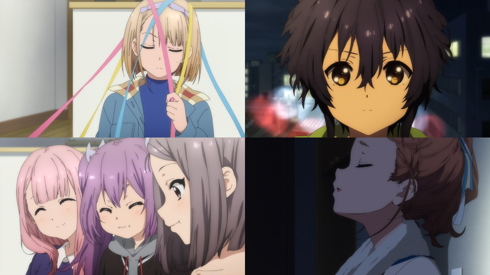
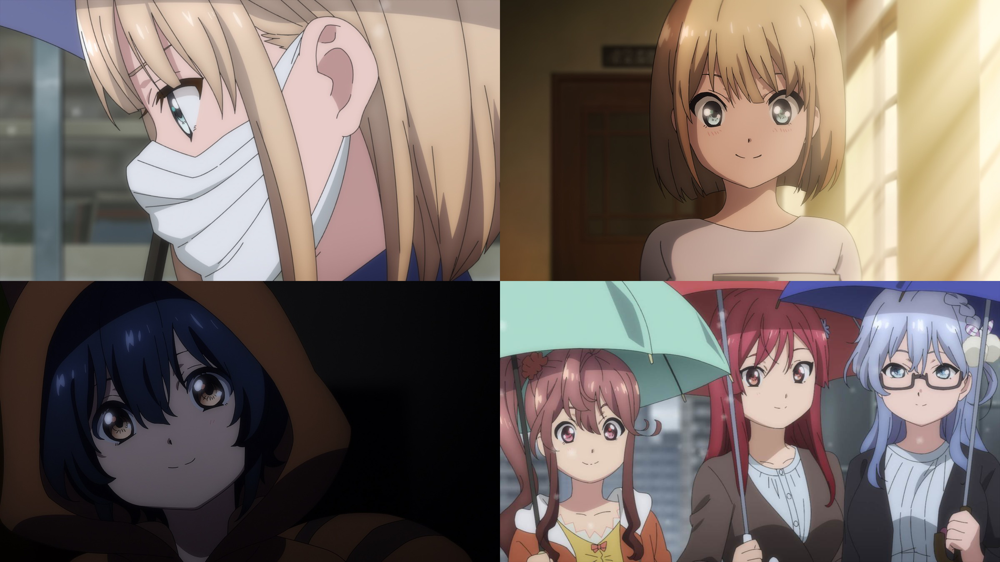
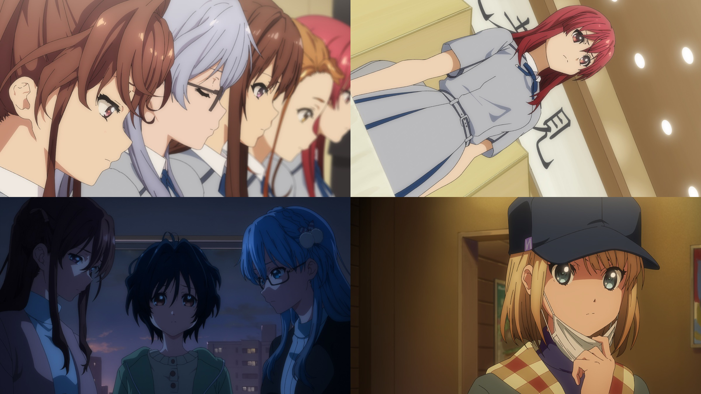
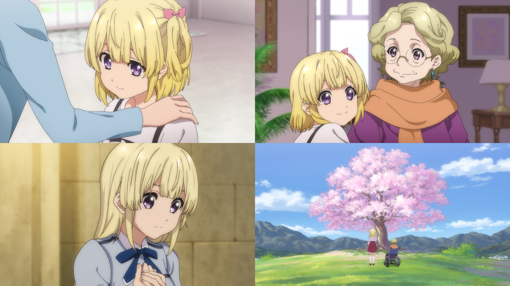

### 22/7 動畫 Anime
##### [Back](../../../readme.md)

#### BD & DVD

- [#13 8+3=？](Anime/Ep13.md)  
{: width="70%"}

- [#12 ナナブンノニジュウニ    七分之二十二](Anime/Ep12.md)  
{: width="70%"}

- [#11 ただその背中を追いつづけて    只是不斷追隨著他](Anime/Ep11.md)  
{: width="70%"}

- [#10 さよなら、私たちの世界    再見了，我們的世界](Anime/Ep10.md)  
{: width="70%"}

- [#9 お星さまのララバイ    星星的搖籃曲](Anime/Ep9.md)  
{: width="70%"}

- [#8 ゆめみるロボット    作夢的機器人](Anime/Ep8.md)  
{: width="70%"}

- [#7 ハッピー☆ジェット☆コースター    HAPPY☆雲霄☆飛車](Anime/Ep7.md)  
{: width="70%"}

- [#6 偶数と奇数のあいだ    偶數與奇數之間](Anime/Ep6.md)  
{: width="70%"}

- [#5 ひっくり返せばええねんで！   翻個面就好了唄！](Anime/Ep5.md)  
{: width="70%"}

- [#4 約束に咲く花    約定綻放之花](Anime/Ep4.md)  
{: width="70%"}

- [#3 こんにちは、新しい世界    你好，新世界](Anime/Ep3.md)  
{: width="70%"}

- [#2 めまいの真ん中    暈眩之中](Anime/Ep2.md)  
{: width="70%"}

- [#1 さよなら、私のささやかな世界    再見了，我那小小的世界](Anime/Ep1.md)  
{: width="70%"}
