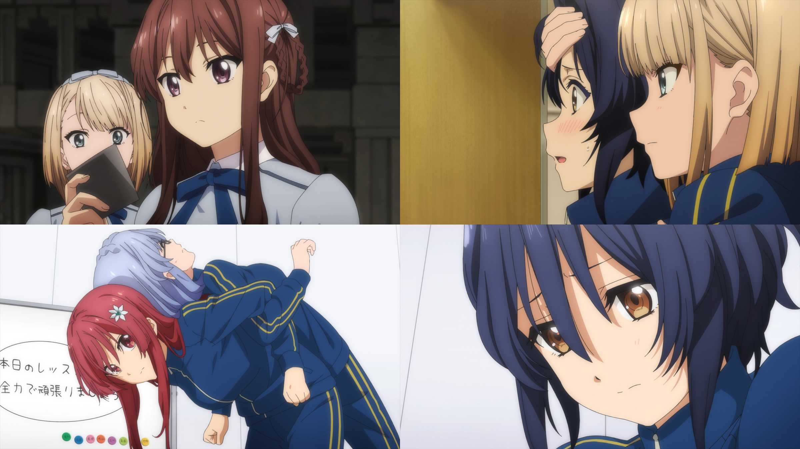

### #3 こんにちは、新しい世界   你好，新世界
##### [Back](Anime_List.md)

{: width="70%"}  

##### 故事 Story
“壁”からの指令により、22/7のお披露目ライブが2月27日に決まる。  
ライブに向けて、みうたちはレッスン漬けの毎日。しかしセンターを任されたみうが、メンバーの足を引っ張ってしまう。  
「今はあなたが真ん中なの。これ以上ガッカリさせないで！」  
ニコルから喝を入れられるみう。センターとして、一体自分に何ができるのだろうか？  
そして、ライブ当日。ステージに立ったみうは、そこで予想外の光景を目の当たりにする。  

##### 工作人員 Staff
脚本：永井千晶  
絵コンテ：森本育郎  
演出：大矢雄嗣  
総作画監督：髙田晃  
作画監督：牧野和俊、横松雄馬、たかはし隆子、田川裕子、香田知樹、樋口香里  

<video width="100%" height="100%" controls>
  <source src="  " type="video/mp4">
</video>

<table>
  <tr>
    <th>Raw</th>
    <th><a href="https://nyaa.si/view/1254266">Source</a></th>
  </tr>
  <tr>
    <th>Sub</th>
    <th><a href="https://ani.gamer.com.tw/animeVideo.php?sn=14592">CHT Sub | 巴哈</a></th>
  </tr>
</table>
