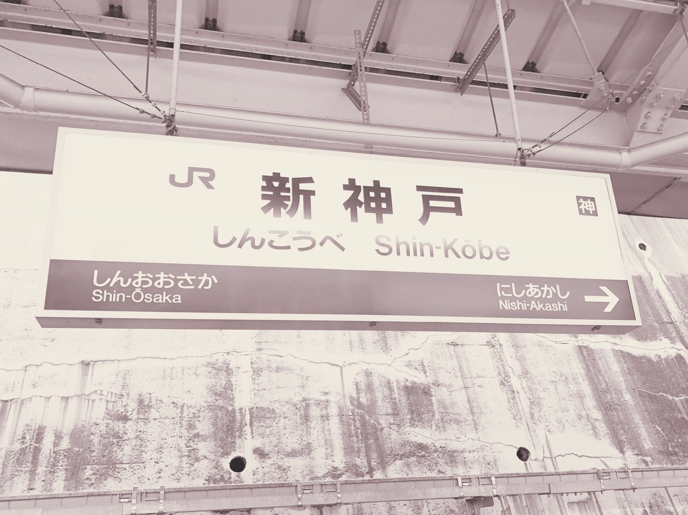
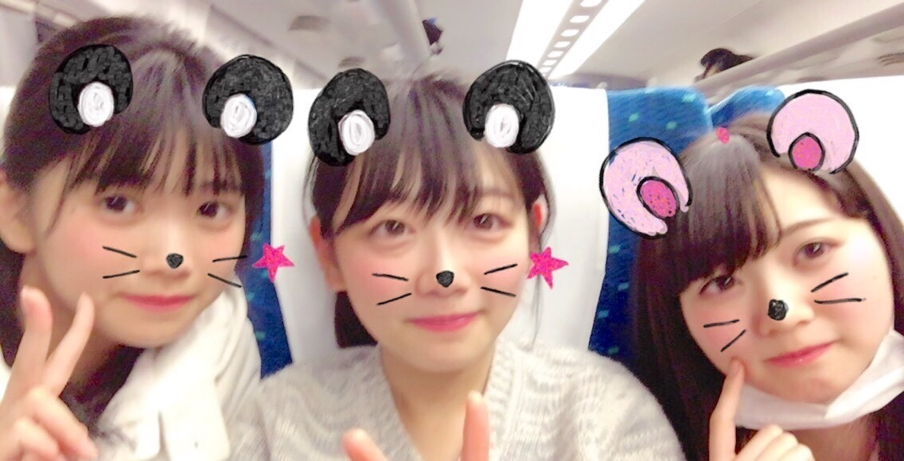

### ♦︎ ♦︎ ♦︎
[2017.12.26](http://blog.nanabunnonijyuuni.com/s/n227/diary/detail/58?ima=0939&cd=blog)
      
朝起きたら指から血がでてました。何があったんでしょう。  
寝てる時の自分ってこわいですよね、どうなってるんだろう。
 
そんな朝でした
          
そして今日地元、兵庫に帰ってきました…！！
    

 
 
 
 
 
 
新神戸のホームの匂いやっぱり好きやな〜帰ってきたな〜って思います。
 
 
 
 
 
 
 
 
 
 
新幹線乗ると毎週レッスンを泊まりで行ってたのを思い出します
 
 
 
 
 
 
ふと初めてのレッスンの時写真撮ったな〜と思って探してたらありました！
 
 
 
 
 
 
 
 
 
ふぁい
 

 
 
 
 
 
 
 
 
 
 
 
ほぼ一年前かな、初めて3人で撮った写真な気がする…
 
 
 
 
 
 
みんな同じ口のかたち、若干のぎこちなさが面白いですね
 
 
 
 
懐かしくて恥ずかしくてぬあってなりました
 
 
 
 
 
 
 
 
 
 
 
私は窓際定位置です
 
 
 
 
 
 
2人が楽しそうに話してるのを聞きたいんですけど直接2人を見てると会話に巻き込まれるのでいつも窓越しにちらっとみてました笑
 
 
 
 
 
この2人の会話を聞いてるの好きなんです。
 
 
 
 
 
 
 
またお泊まりしたいな〜
              test
