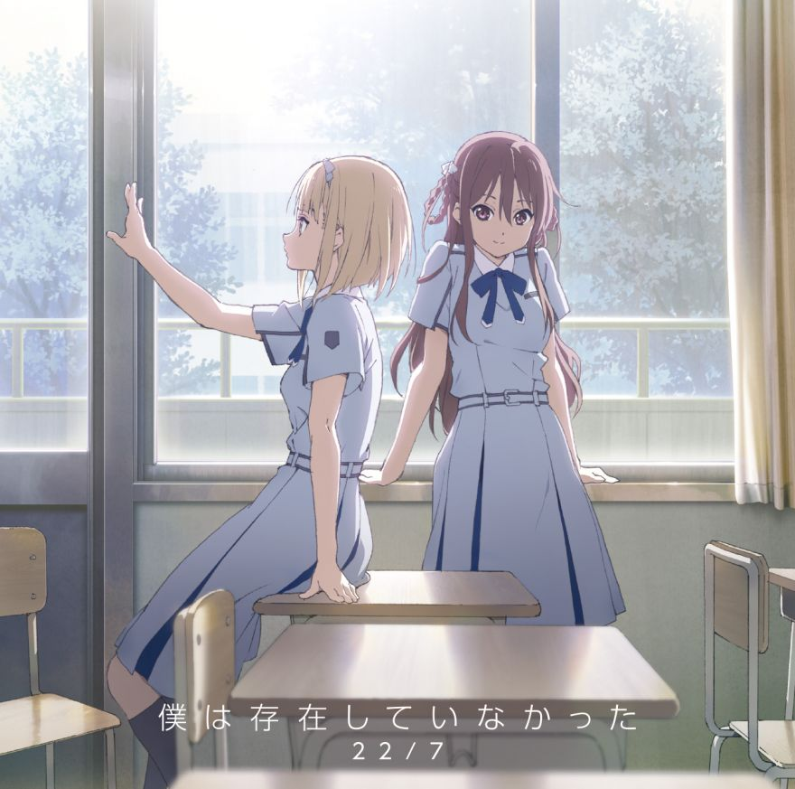

### 僕は存在していなかった Boku wa Sonzai Shiteinakatta 
##### [Back](Music_List.md)

#### 僕は存在していなかった【完全生産限定盤 Type-A】  
{: width="70%"}  
Date: 20Sept,2017  

#### 僕は存在していなかった【完全生産限定盤 Type-B】  
{: width="70%"}  
Date: 20Sept,2017  

**01.僕は存在していなかった**  
<audio controls="controls">
  <source type="audio/mp3" src="../../Music/01_BokuwaSonzaiShiteinakatta/01.%20僕は存在していなかった.mp3"></source>
  
Your browser does not support the audio element.

</audio>

**02.地下鉄抵抗主義**  
<audio controls="controls">
  <source type="audio/mp3" src="../../Music/01_BokuwaSonzaiShiteinakatta/02.%20地下鉄抵抗主義.mp3"></source>
  
Your browser does not support the audio element.

</audio>

**03.11人が集まった理由**  
<audio controls="controls">
  <source type="audio/mp3" src="../../Music/01_BokuwaSonzaiShiteinakatta/03.%2011人が集まった理由.mp3"></source>
  
Your browser does not support the audio element.

</audio>

**04.僕は存在していなかった -off vocal ver.**  
<audio controls="controls">
  <source type="audio/mp3" src="../../Music/01_BokuwaSonzaiShiteinakatta/04.%20僕は存在していなかった%20-off%20vocal%20ver.-%20.mp3"></source>
  
Your browser does not support the audio element.

</audio>

**05.地下鉄抵抗主義 -off vocal ver.**  
<audio controls="controls">
  <source type="audio/mp3" src="../../Music/01_BokuwaSonzaiShiteinakatta/05.%20地下鉄抵抗主義%20-off%20vocal%20ver.-%20.mp3"></source>
  
Your browser does not support the audio element.

</audio>

**06.11人が集まった理由 -off vocal ver.**  
<audio controls="controls">
  <source type="audio/mp3" src="../../Music/01_BokuwaSonzaiShiteinakatta/06.%2011人が集まった理由%20-off%20vocal%20ver.-%20.mp3"></source>
  
Your browser does not support the audio element.

</audio>
