### 22/7 音楽の時間 Ongaku no Jikan
##### [Back](Music_List.md)

#### 22/7 音楽の時間  翻唱歌曲 Cover Songs
{: width="70%"}  
Date: 27May,2020  

**01.青いスタスィオン**  
滝川みう（CV. 西條和）  
{: width="70%"}  
<audio controls="controls">
  <source type="audio/mp3" src="../../Music/227%20Ongaku%20no%20Jikan/01.青いスタスィオン.mp3"></source>
  
Your browser does not support the audio element.

</audio>

**02.恋するフォーチュンクッキー**  
藤間桜（CV. 天城サリー）  
戸田ジュン（CV. 海乃るり）  
滝川みう（CV. 西條和）  
東条悠希（CV. 高辻麗）  
丸山あかね（CV. 白沢かなえ）  
{: width="70%"}  
<audio controls="controls">
  <source type="audio/mp3" src="../../Music/227%20Ongaku%20no%20Jikan/02.恋するフォーチュンクッキー.mp3"></source>
  
Your browser does not support the audio element.

</audio>

**03.コネクト**  
河野都（CV. 倉岡水巴）  
戸田ジュン（CV. 海乃るり）  
{: width="70%"}  
<audio controls="controls">
  <source type="audio/mp3" src="../../Music/227%20Ongaku%20no%20Jikan/03.コネクト.mp3"></source>
  
Your browser does not support the audio element.

</audio>

**04.象さんのすきゃんてぃ**  
丸山あかね（CV. 白沢かなえ）  
立川絢香（CV. 宮瀬玲奈）  
{: width="70%"}  
<audio controls="controls">
  <source type="audio/mp3" src="../../Music/227%20Ongaku%20no%20Jikan/04.象さんのすきゃんてぃ.mp3"></source>
  
Your browser does not support the audio element.

</audio>

**05.Preserved Roses**  
佐藤麗華（CV. 帆風千春）  
柊つぼみ（CV. 武田愛奈）   
{: width="70%"}  
<audio controls="controls">
  <source type="audio/mp3" src="../../Music/227%20Ongaku%20no%20Jikan/05.Preserved%20Roses.mp3"></source>
  
Your browser does not support the audio element.

</audio>

**06.ヘビーローテーション**  
藤間桜（CV. 天城サリー）  
戸田ジュン（CV. 海乃るり）  
河野都（CV. 倉岡水巴）  
佐藤麗華（CV. 帆風千春）  
丸山あかね（CV. 白沢かなえ）  
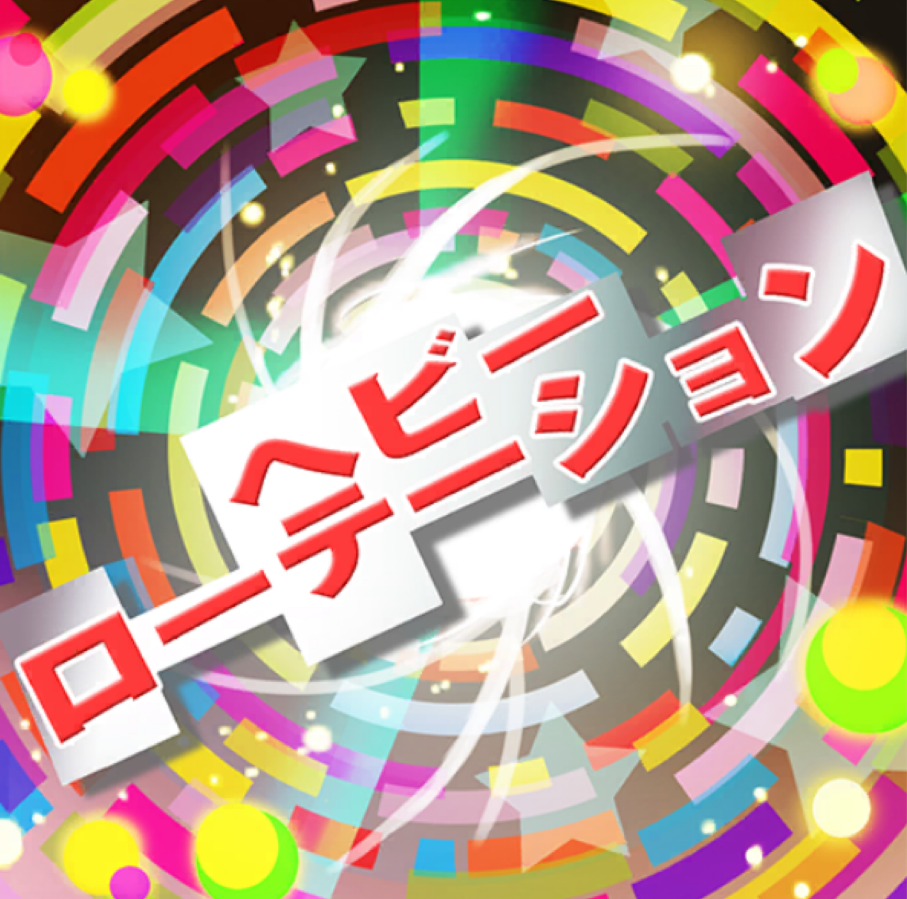{: width="70%"}  
<audio controls="controls">
  <source type="audio/mp3" src="../../Music/227%20Ongaku%20no%20Jikan/06.ヘビーローテーション.mp3"></source>
  
Your browser does not support the audio element.

</audio>

**07.時の河を越えて**  
神木みかみ（CV. 涼花萌）  
東条悠希（CV. 高辻麗）  
柊つぼみ（CV. 武田愛奈）  
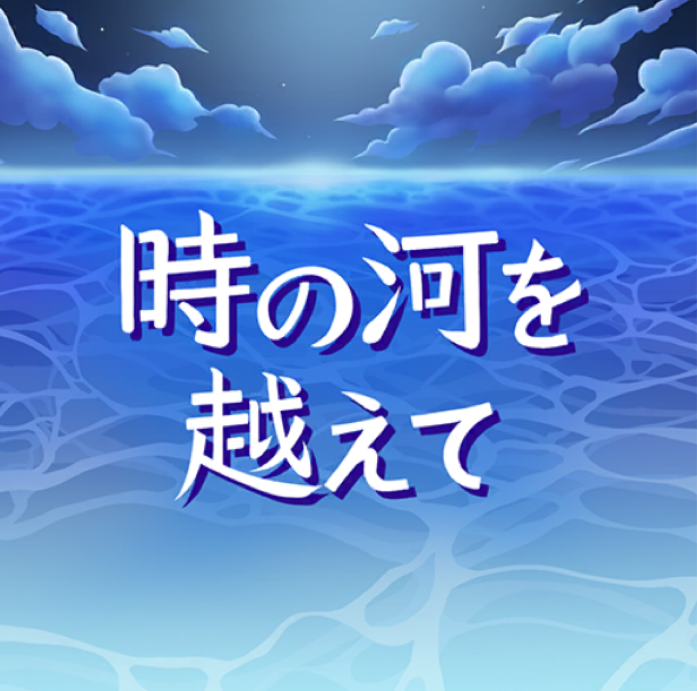{: width="70%"}  
<audio controls="controls">
  <source type="audio/mp3" src="../../Music/227%20Ongaku%20no%20Jikan/07.時の河を越えて.mp3"></source>
  
Your browser does not support the audio element.

</audio>

**08.桃色タイフーン**  
東条悠希（CV. 高辻麗）  
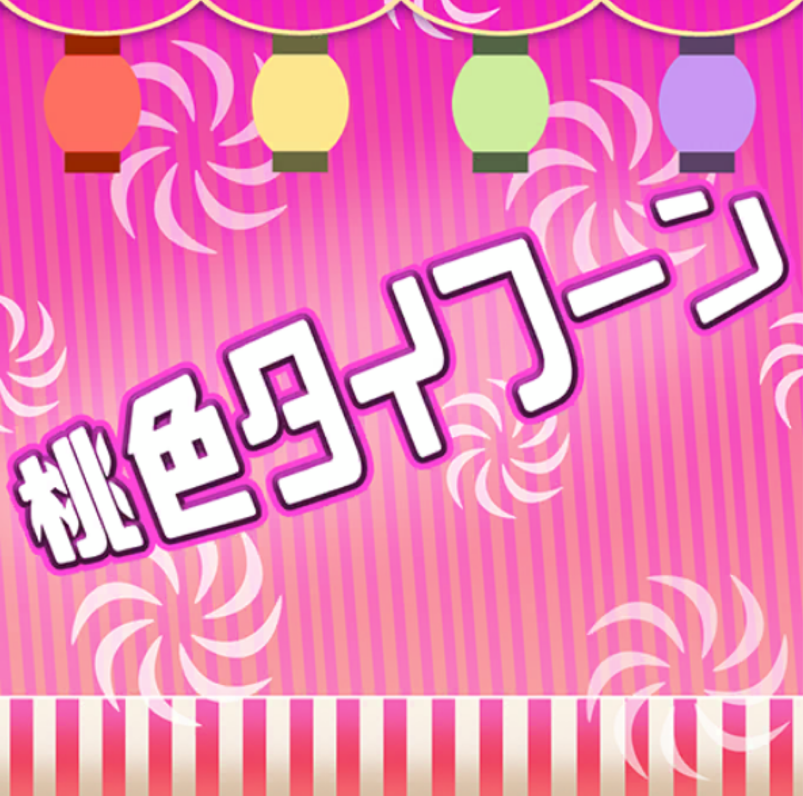{: width="70%"}  
<audio controls="controls">
  <source type="audio/mp3" src="../../Music/227%20Ongaku%20no%20Jikan/08.桃色タイフーン.mp3"></source>
  
Your browser does not support the audio element.

</audio>

**09.IGNITE**  
佐藤麗華（CV. 帆風千春）  
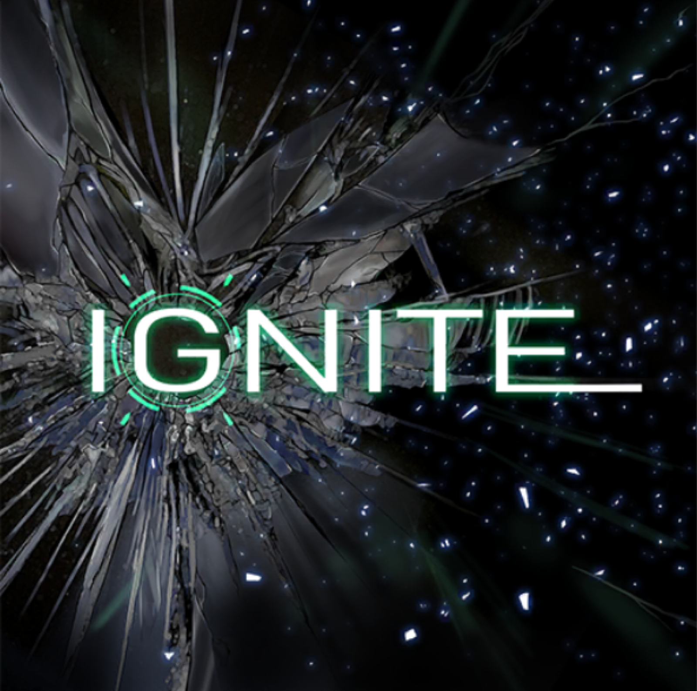{: width="70%"}  
<audio controls="controls">
  <source type="audio/mp3" src="../../Music/227%20Ongaku%20no%20Jikan/09.IGNITE.mp3"></source>
  
Your browser does not support the audio element.

</audio>

**10.色彩**  
河野都（CV. 倉岡水巴）  
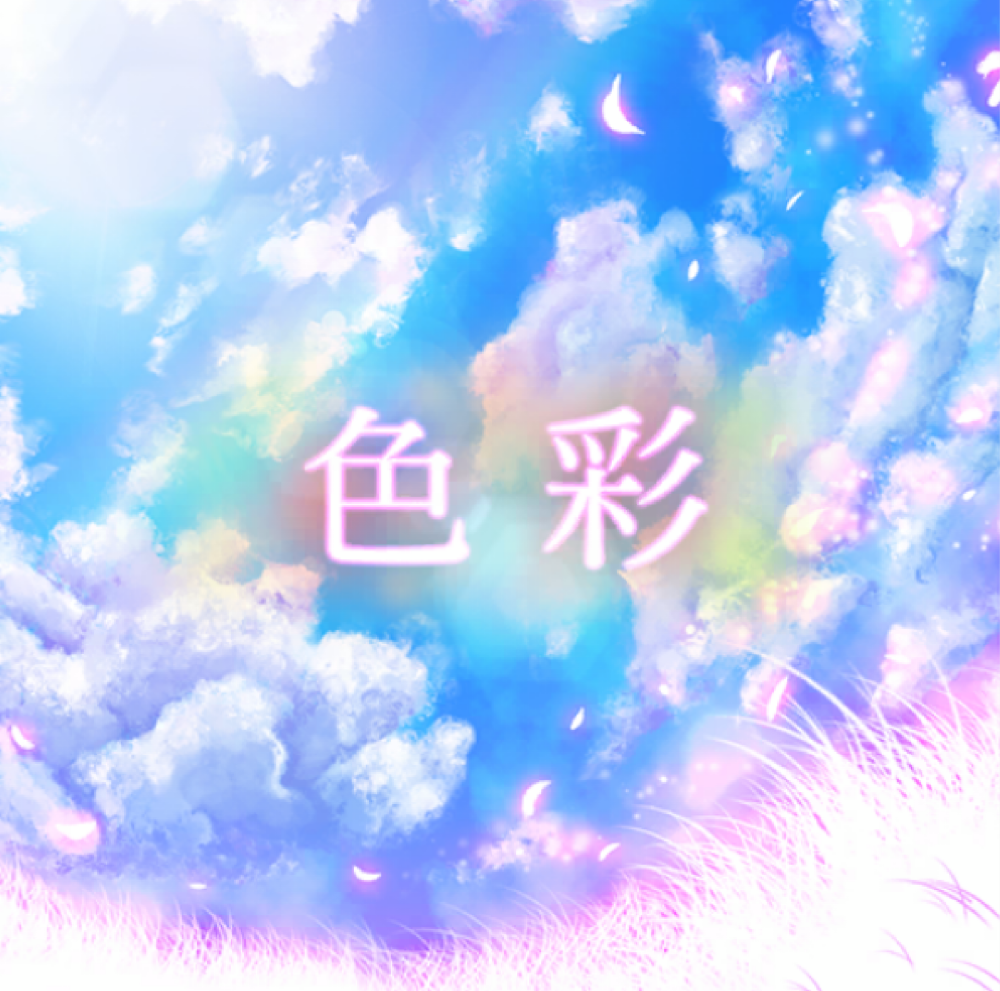{: width="70%"}  
<audio controls="controls">
  <source type="audio/mp3" src="../../Music/227%20Ongaku%20no%20Jikan/10.色彩.mp3"></source>
  
Your browser does not support the audio element.

</audio>

**11.センチメンタルクライシス**  
戸田ジュン（CV. 海乃るり）  
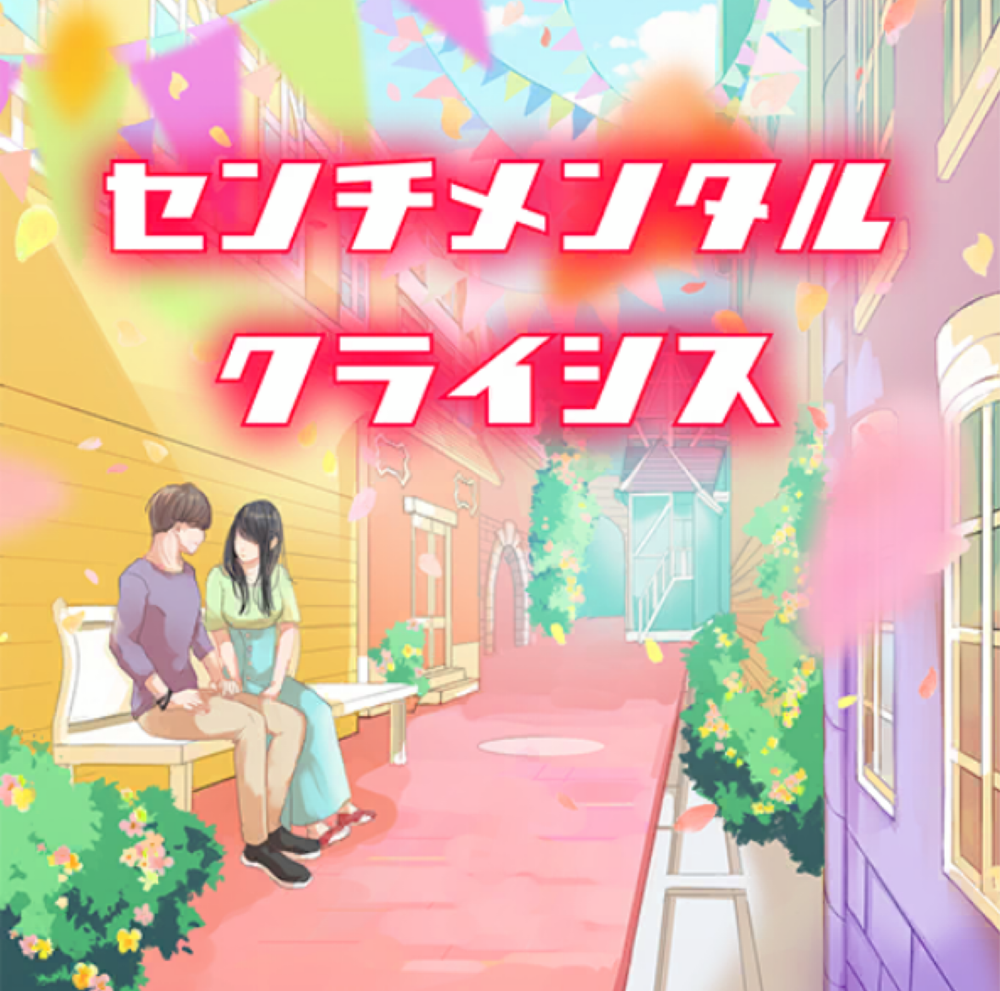{: width="70%"}  
<audio controls="controls">
  <source type="audio/mp3" src="../../Music/227%20Ongaku%20no%20Jikan/11.センチメンタルクライシス.mp3"></source>
  
Your browser does not support the audio element.

</audio>

**12.名前のない怪物**  
佐藤麗華（CV. 帆風千春）  
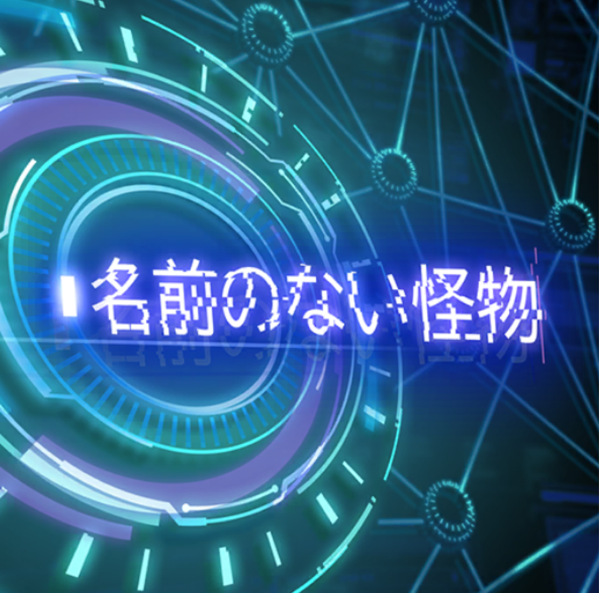{: width="70%"}  
<audio controls="controls">
  <source type="audio/mp3" src="../../Music/227%20Ongaku%20no%20Jikan/12.名前のない怪物.mp3"></source>
  
Your browser does not support the audio element.

</audio>

**13.桜、みんなで食べた**  
藤間桜（CV. 天城サリー）  
丸山あかね（CV. 白沢かなえ）  
立川絢香（CV. 宮瀬玲奈）  
河野都（CV. 倉岡水巴）  
東条悠希（CV. 高辻麗）  
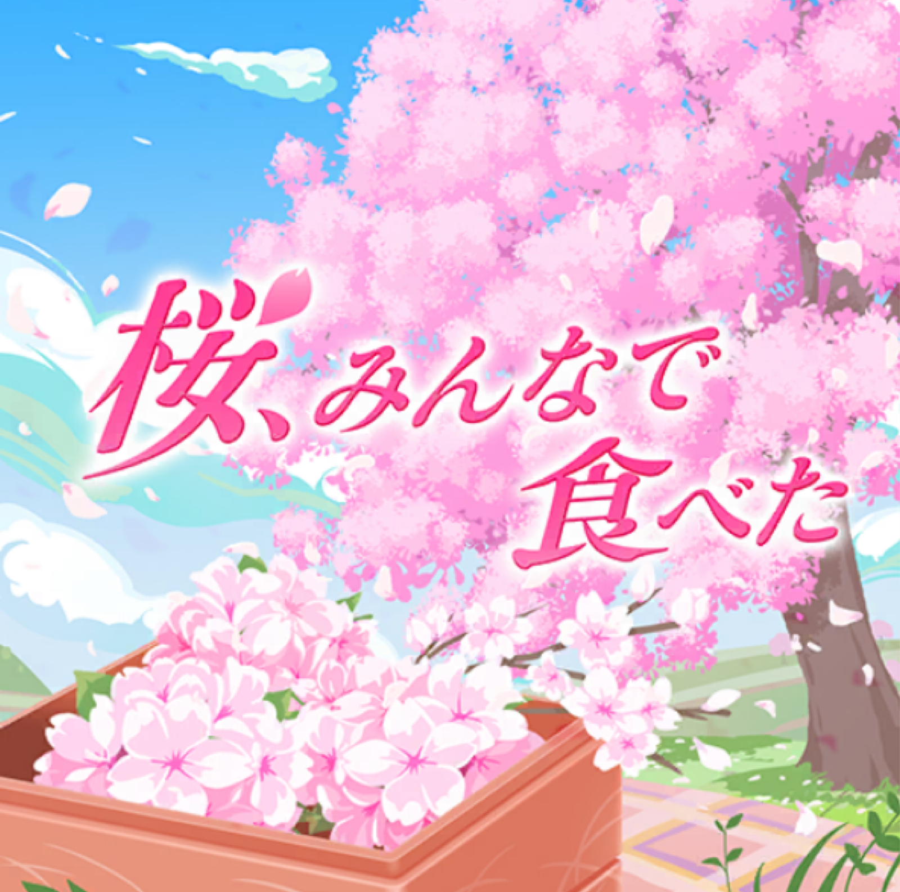{: width="70%"}  
<audio controls="controls">
  <source type="audio/mp3" src="../../Music/227%20Ongaku%20no%20Jikan/13.桜、みんなで食べた.mp3"></source>
  
Your browser does not support the audio element.

</audio>

**14.oath sign**  
藤間桜（CV. 天城サリー）  
{: width="70%"}  
<audio controls="controls">
  <source type="audio/mp3" src="../../Music/227%20Ongaku%20no%20Jikan/14.oath%20sign.mp3"></source>
  
Your browser does not support the audio element.

</audio>

**15.ideal white**  
河野都（CV. 倉岡水巴）  
{: width="70%"}  
^ Currently Unavailable
<audio controls="controls">
  <source type="audio/mp3" src="../../Music/227%20Ongaku%20no%20Jikan/15.ideal%20white.mp3"></source>
  
Your browser does not support the audio element.

</audio>

**16.オーマイガー!**  
河野都（CV. 倉岡水巴）  
藤間桜（CV. 天城サリー）  
斎藤ニコル（CV. 河瀬詩）  
立川絢香（CV. 宮瀬玲奈）  
神木みかみ（CV. 涼花萌）  
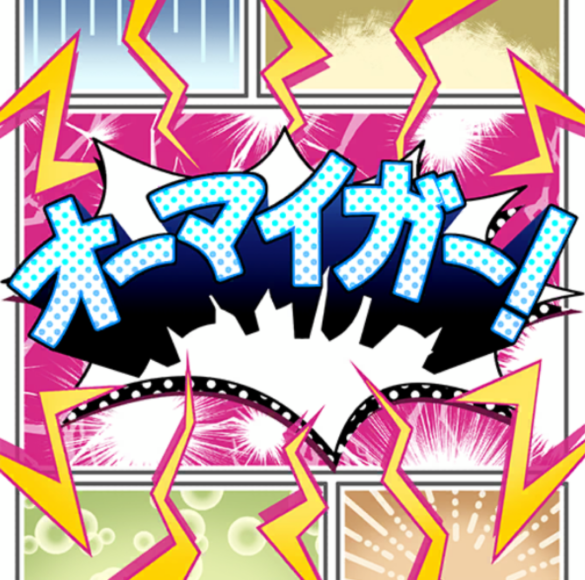{: width="70%"}  
^ Currently Unavailable
<audio controls="controls">
  <source type="audio/mp3" src="../../Music/227%20Ongaku%20no%20Jikan/16.オーマイガー!.mp3"></source>
  
Your browser does not support the audio element.

</audio>

**17.SPEED STAR**  
柊つぼみ（CV. 武田愛奈）  
{: width="70%"}  
^ Currently Unavailable
<audio controls="controls">
  <source type="audio/mp3" src="../../Music/227%20Ongaku%20no%20Jikan/17.SPEED%20STAR.mp3"></source>
  
Your browser does not support the audio element.

</audio>

**18.走れ!ペンギン**  
佐藤麗華（CV. 帆風千春）  
神木みかみ（CV. 涼花萌）  
丸山あかね（CV. 白沢かなえ）  
柊つぼみ（CV. 武田愛奈）  
立川絢香（CV. 宮瀬玲奈）  
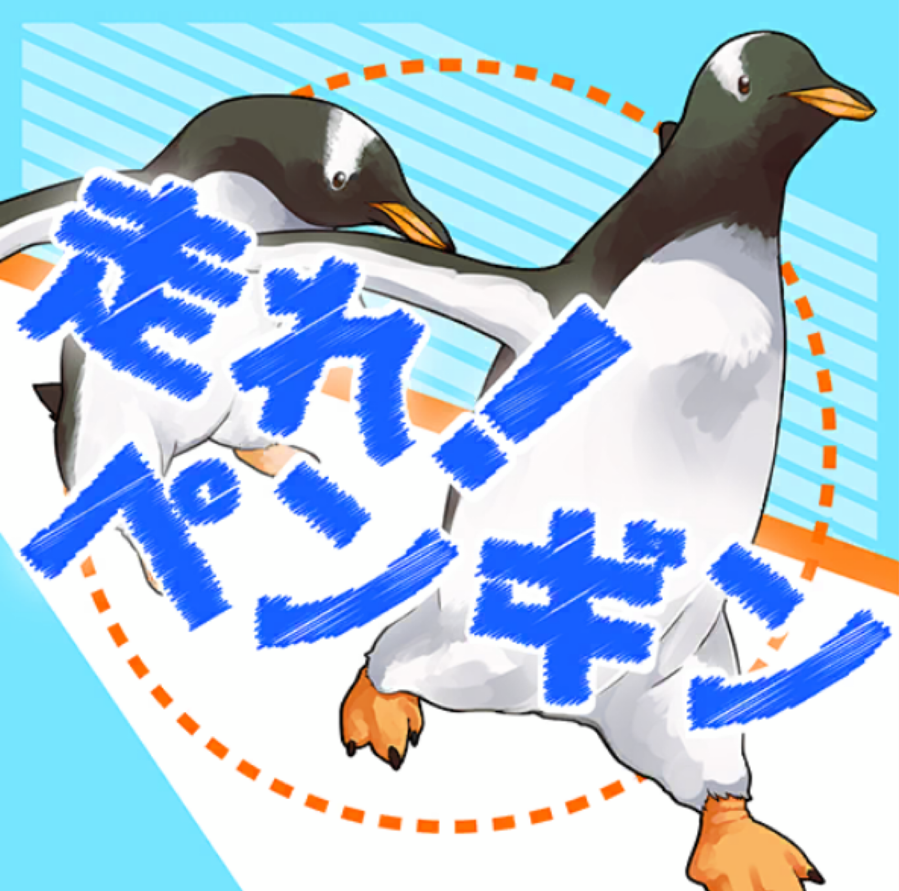{: width="70%"}  
^ Currently Unavailable
<audio controls="controls">
  <source type="audio/mp3" src="../../Music/227%20Ongaku%20no%20Jikan/18.走れ!ペンギン.mp3"></source>
  
Your browser does not support the audio element.

</audio>

---
#### 20200605 〈物語〉シリーズコラボイベント〈前編〉

**19.君の知らない物語**  
佐藤麗華（CV. 帆風千春）  
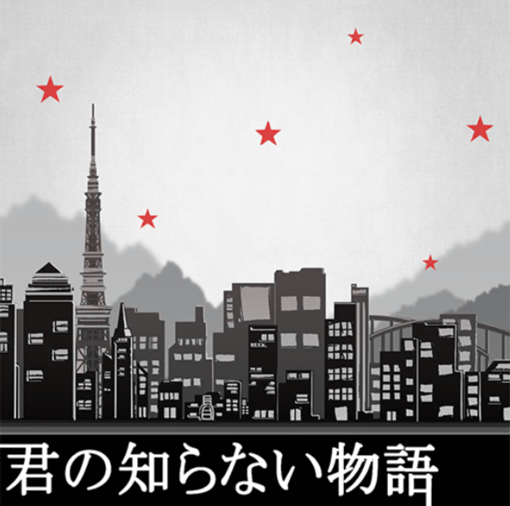{: width="70%"}  
<audio controls="controls">
  <source type="audio/mp3" src="../../Music/227%20Ongaku%20no%20Jikan/19.君の知らない物語.mp3"></source>
  
Your browser does not support the audio element.

</audio>

**20.staple stable**  
滝川みう（CV. 西條和）  
{: width="70%"}  
<audio controls="controls">
  <source type="audio/mp3" src="../../Music/227%20Ongaku%20no%20Jikan/20.staple%20stable.mp3"></source>
  
Your browser does not support the audio element.

</audio>

**21.帰り道**  
藤間桜（CV. 天城サリー）  
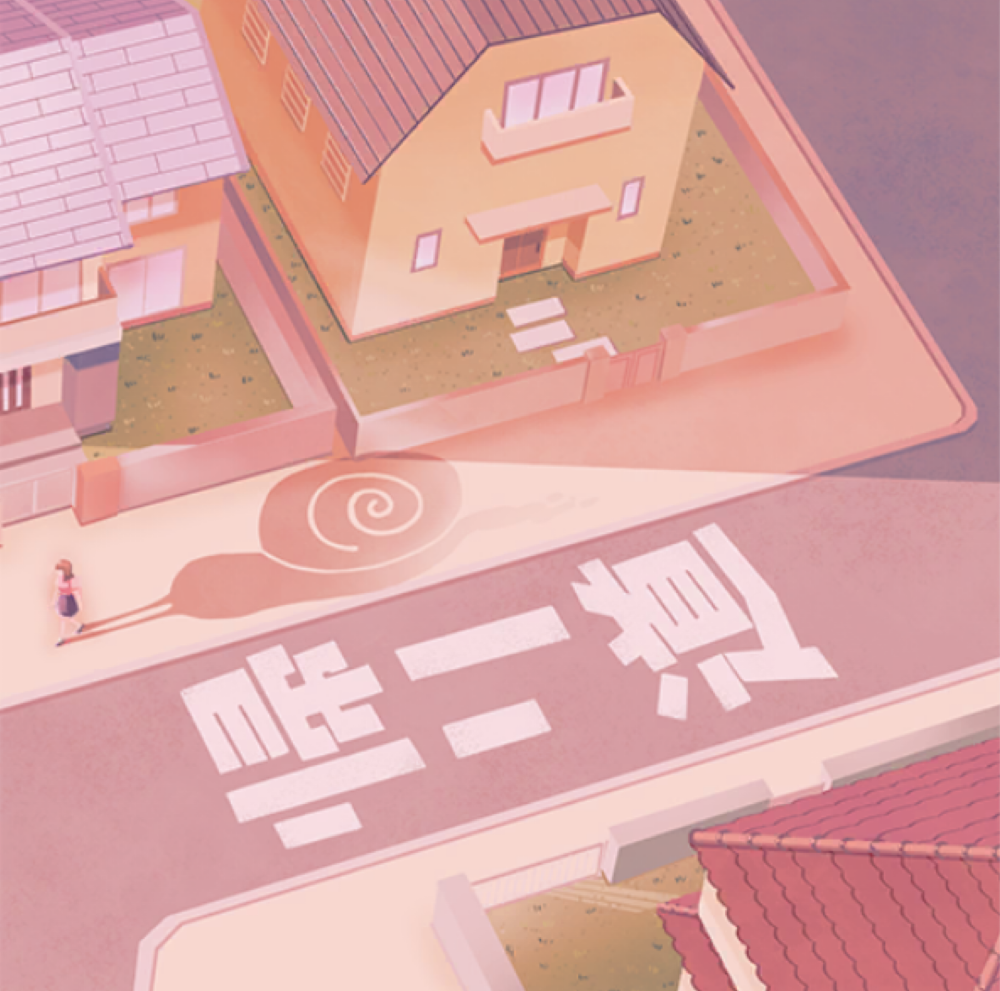{: width="70%"}  
<audio controls="controls">
  <source type="audio/mp3" src="../../Music/227%20Ongaku%20no%20Jikan/21.帰り道.mp3"></source>
  
Your browser does not support the audio element.

</audio>

**22.marshmallow justice**  
藤間桜（CV. 天城サリー）  
{: width="70%"}  
<audio controls="controls">
  <source type="audio/mp3" src="../../Music/227%20Ongaku%20no%20Jikan/22.marshmallow%20justice.mp3"></source>
  
Your browser does not support the audio element.

</audio>
