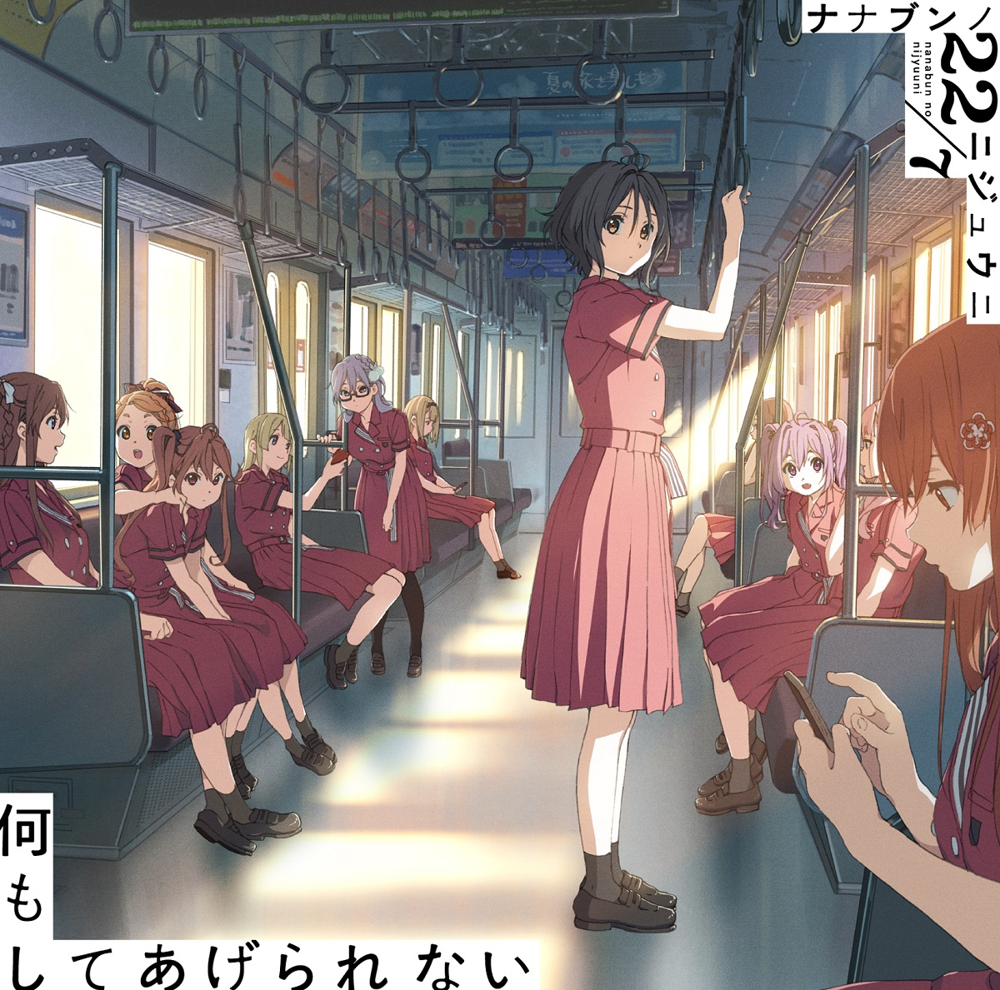
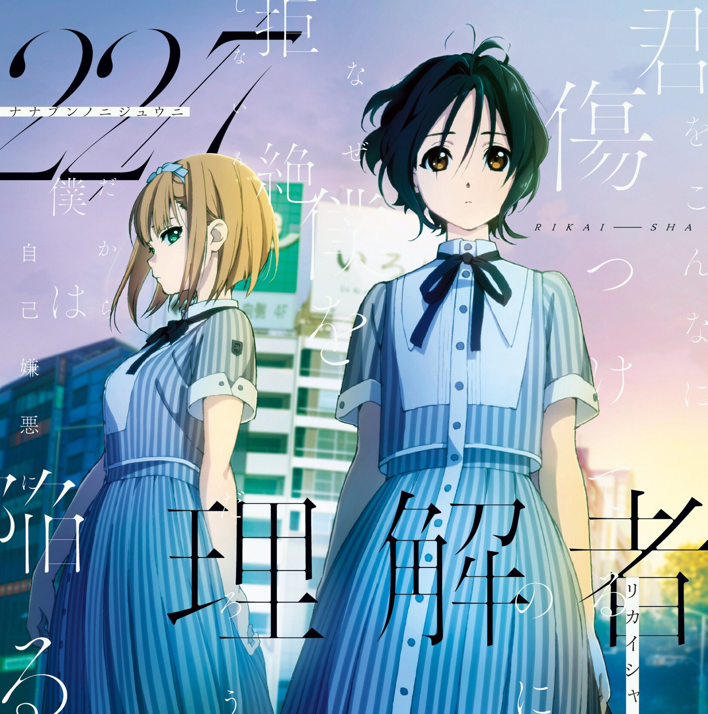
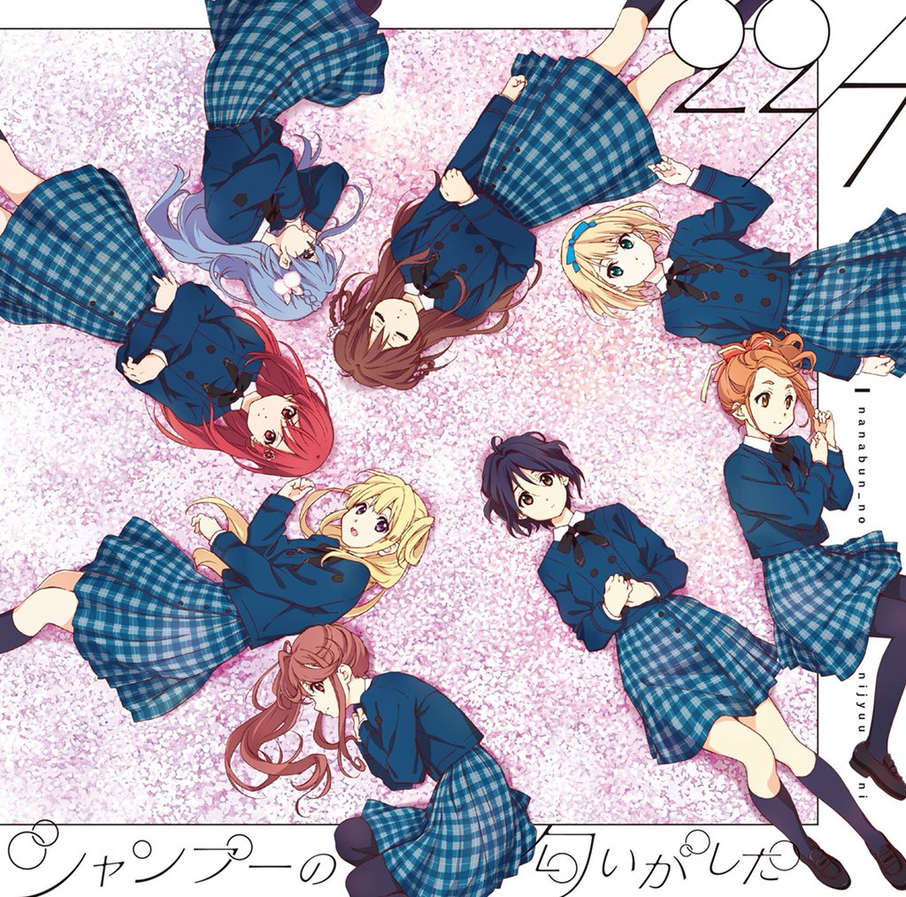
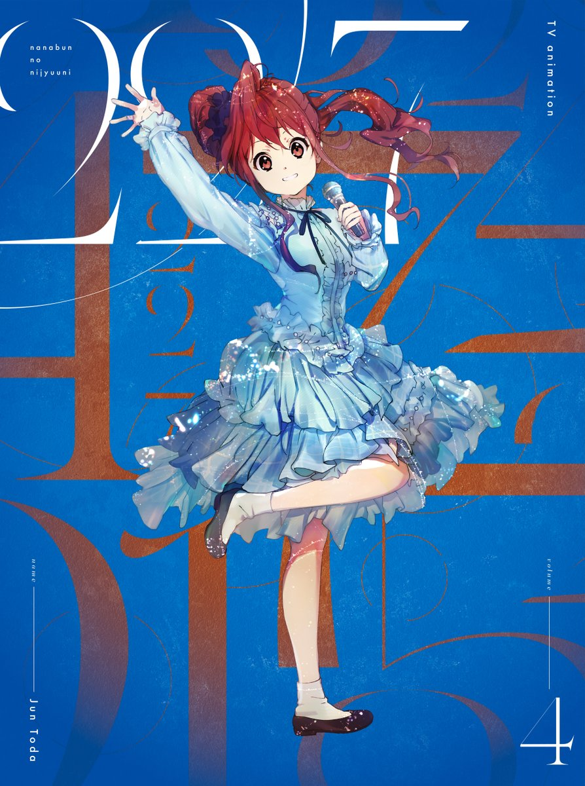
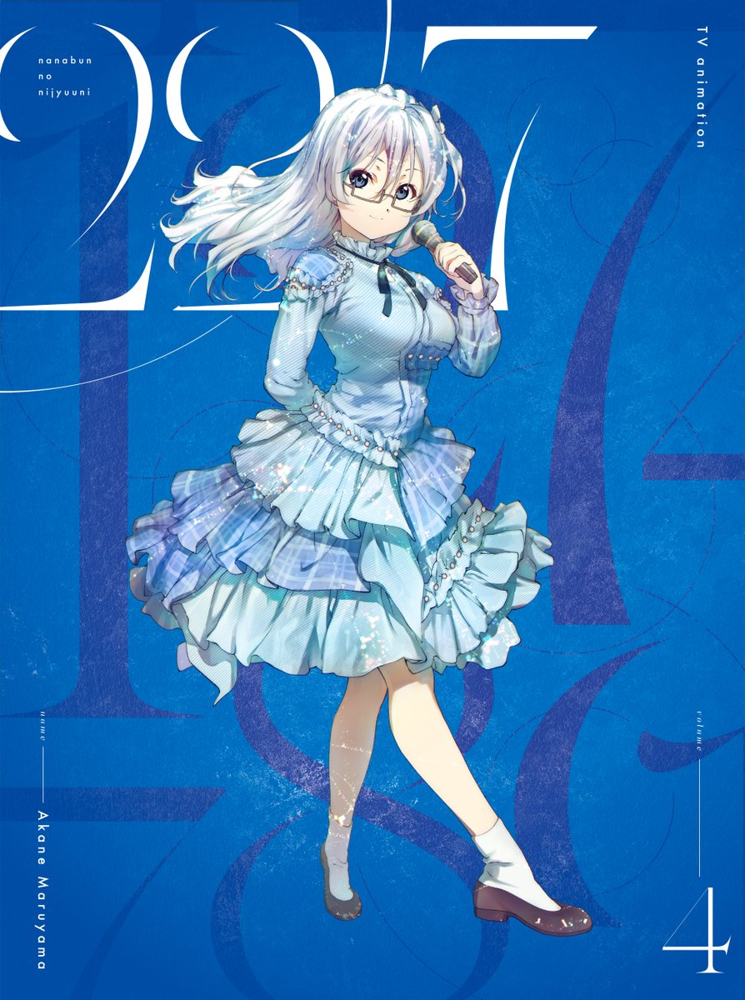
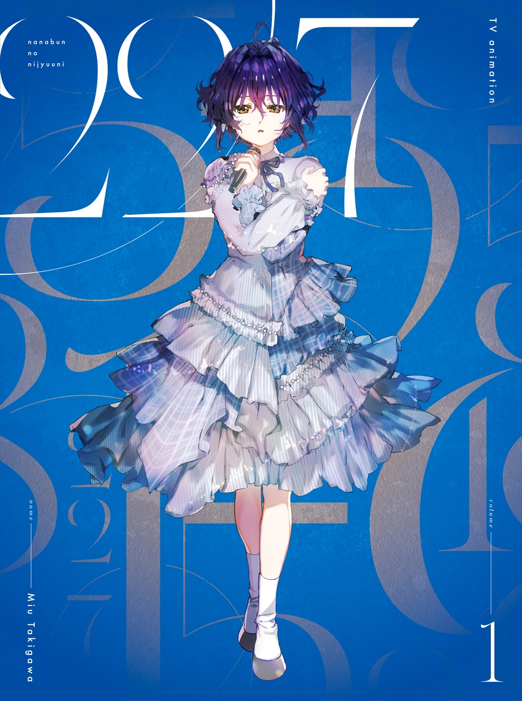

### 音樂 Music
##### [Back](../../readme.md)

<table>
<tr>
<th><a href="#single">單曲 Single</a></th>
<th><a href="#digitial_single">數位單曲 Digitial Single</a></th>
</tr>
<tr>
<th><a href="#bddvd">BD & DVD</a></th>
<th><a href="#Ongaku_no_Jikan">音楽の時間 Ongaku no Jikan</a></th>
</tr>
</table>

#### 單曲 Single

- [ムズイ Muzui](05_Muzui.html)  

- [何もしてあげられない Nani Mo Shiteagerarenai](04_NaniMoShiteagerarenai.html)  

- [理解者 Rikaisha](03_Rikaisha.html)  

- [シャンプーの匂いがした Shampoo no Nioi ga Shita](02_ShampoonoNioigaShita.html)  

- [僕は存在していなかった Boku wa Sonzai Shiteinakatta](01_BokuwaSonzaiShiteinakatta.html)  

#### 數位單曲 Digitial Single

- [風は吹いてるか? Kaze wa Fuiteruka](Kaze%20wa%20Fuiteruka.html)  
  

#### BD & DVD

- [BD & DVD Vol.6](BDDVD%20Vol6.html)  

  

- [BD & DVD Vol.5](BDDVD%20Vol5.html)  
  

- [BD & DVD Vol.4](BDDVD%20Vol4.html)  

  

- [BD & DVD Vol.3](BDDVD%20Vol3.html)  

  

- [BD & DVD Vol.2](BDDVD%20Vol2.html)  
  

- [BD & DVD Vol.1](BDDVD%20Vol1.html)  
  

#### 音楽の時間 Ongaku no Jikan

- [22/7 音楽の時間 Ongaku no Jikan](227%20Ongaku%20no%20Jikan.html)  

