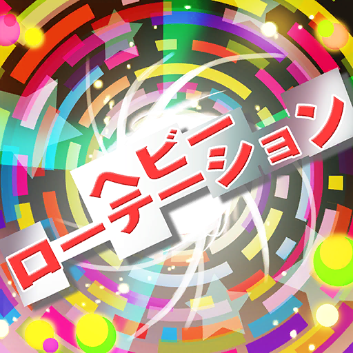
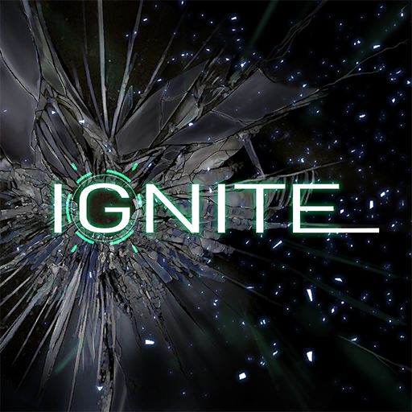
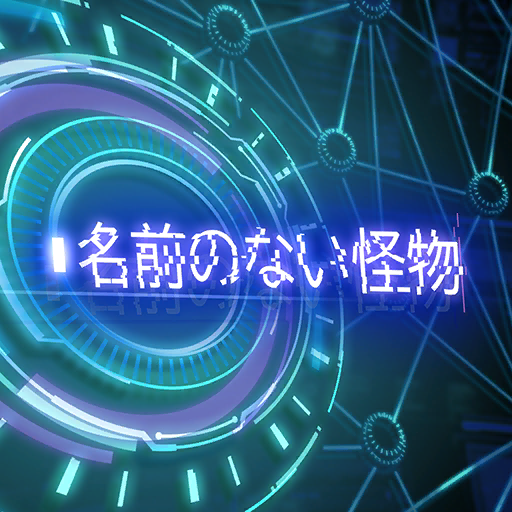
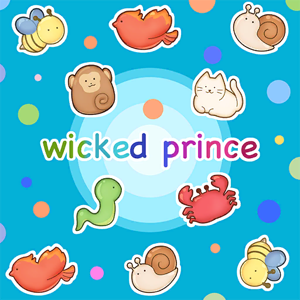
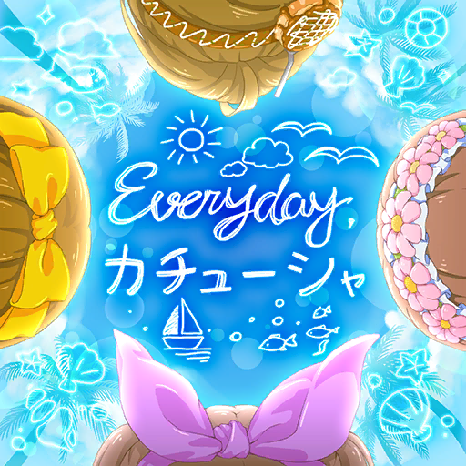
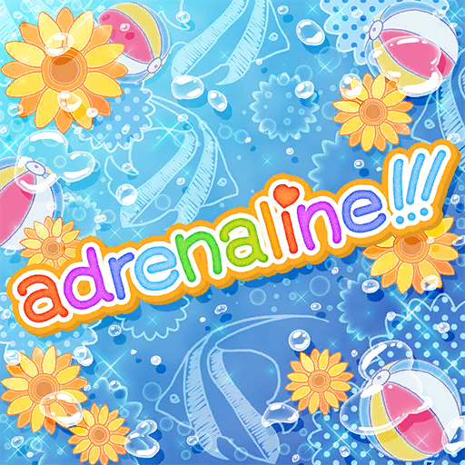
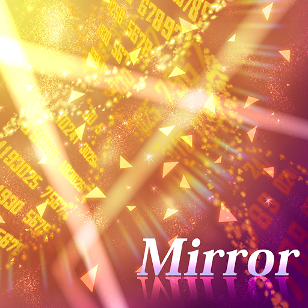

### 22/7 音楽の時間 Ongaku no Jikan - 翻唱歌曲 Cover Songs

<h5><a href="227%20Ongaku%20no%20Jikan.html">Back</a></h5>

<table>
<tr>
  <th><a href="#Monogatari_1">〈物語〉シリーズコラボイベント〈前編〉</a></th>
  <th><a href="#Monogatari_2">〈物語〉シリーズコラボイベント〈後編〉</a></th>
</tr>
<tr>
  <th><a href="#SUMMERSUMMERSUMMER_1">22/7×SUMMER×SUMMER×SUMMER! 前編</a></th>
  <th><a href="#SUMMERSUMMERSUMMER_3">22/7×SUMMER×SUMMER×SUMMER! 後編</a></th>
</tr>
<tr>
  <th><a href="#Princess_of_the_moon_night">稲穂に宿る月夜の姫</a></th>
</tr>
<tr>
  <th><a href="#Mahoka_Koko_no_Rettosei">魔法科高校の劣等生コラボイベント</a></th>
</tr>
<tr>
  <th><a href="#Helloween_GhostLoveSweet">とりっく・おあ・とりーと！～お菓子が好きなオバケの噂～</a></th>
</tr>
<tr>
  <th><a href="#IndivisibleBunkasai_MaidCafe">割り切れない文化祭　演劇メイド喫茶にようこそ！</a></th>
</tr>
</table>

#### 22/7 音楽の時間  翻唱歌曲 Cover Songs
Date: 27May,2020  

**01. 青いスタスィオン**  
滝川みう（CV. 西條和）  
 
<audio controls="controls">
  <source type="audio/mp3" src="../../Music/227%20Ongaku%20no%20Jikan/Cover%20Songs/01.%20青いスタスィオン.mp3"></source>
  
Your browser does not support the audio element.

</audio>

**02. 恋するフォーチュンクッキー**  
藤間桜（CV. 天城サリー）  
戸田ジュン（CV. 海乃るり）  
滝川みう（CV. 西條和）  
東条悠希（CV. 高辻麗）  
丸山あかね（CV. 白沢かなえ）  
 
<audio controls="controls">
  <source type="audio/mp3" src="../../Music/227%20Ongaku%20no%20Jikan/Cover%20Songs/02.%20恋するフォーチュンクッキー.mp3"></source>
  
Your browser does not support the audio element.

</audio>

**03. コネクト**  
河野都（CV. 倉岡水巴）  
戸田ジュン（CV. 海乃るり）  
 
<audio controls="controls">
  <source type="audio/mp3" src="../../Music/227%20Ongaku%20no%20Jikan/Cover%20Songs/03.%20コネクト.mp3"></source>
  
Your browser does not support the audio element.

</audio>

**04. 象さんのすきゃんてぃ**  
丸山あかね（CV. 白沢かなえ）  
立川絢香（CV. 宮瀬玲奈）  
 
<audio controls="controls">
  <source type="audio/mp3" src="../../Music/227%20Ongaku%20no%20Jikan/Cover%20Songs/04.%20象さんのすきゃんてぃ.mp3"></source>
  
Your browser does not support the audio element.

</audio>

**05. Preserved Roses**  
佐藤麗華（CV. 帆風千春）  
柊つぼみ（CV. 武田愛奈）   
 
<audio controls="controls">
  <source type="audio/mp3" src="../../Music/227%20Ongaku%20no%20Jikan/Cover%20Songs/05.%20Preserved%20Roses.mp3"></source>
  
Your browser does not support the audio element.

</audio>

**06. ヘビーローテーション**  
藤間桜（CV. 天城サリー）  
戸田ジュン（CV. 海乃るり）  
河野都（CV. 倉岡水巴）  
佐藤麗華（CV. 帆風千春）  
丸山あかね（CV. 白沢かなえ）  
 
<audio controls="controls">
  <source type="audio/mp3" src="../../Music/227%20Ongaku%20no%20Jikan/Cover%20Songs/06.%20ヘビーローテーション.mp3"></source>
  
Your browser does not support the audio element.

</audio>

**07. 時の河を越えて**  
神木みかみ（CV. 涼花萌）  
東条悠希（CV. 高辻麗）  
柊つぼみ（CV. 武田愛奈）  
 
<audio controls="controls">
  <source type="audio/mp3" src="../../Music/227%20Ongaku%20no%20Jikan/Cover%20Songs/07.%20時の河を越えて.mp3"></source>
  
Your browser does not support the audio element.

</audio>

**08. 桃色タイフーン**  
東条悠希（CV. 高辻麗）  
 
<audio controls="controls">
  <source type="audio/mp3" src="../../Music/227%20Ongaku%20no%20Jikan/Cover%20Songs/08.%20桃色タイフーン.mp3"></source>
  
Your browser does not support the audio element.

</audio>

**09. IGNITE**  
佐藤麗華（CV. 帆風千春）  
 
<audio controls="controls">
  <source type="audio/mp3" src="../../Music/227%20Ongaku%20no%20Jikan/Cover%20Songs/09.%20IGNITE.mp3"></source>
  
Your browser does not support the audio element.

</audio>

**10. 色彩**  
河野都（CV. 倉岡水巴）  
 
<audio controls="controls">
  <source type="audio/mp3" src="../../Music/227%20Ongaku%20no%20Jikan/Cover%20Songs/10.%20色彩.mp3"></source>
  
Your browser does not support the audio element.

</audio>

**11. センチメンタルクライシス**  
戸田ジュン（CV. 海乃るり）  
 
<audio controls="controls">
  <source type="audio/mp3" src="../../Music/227%20Ongaku%20no%20Jikan/Cover%20Songs/11.%20センチメンタルクライシス.mp3"></source>
  
Your browser does not support the audio element.

</audio>

**12. 名前のない怪物**  
佐藤麗華（CV. 帆風千春）  
 
<audio controls="controls">
  <source type="audio/mp3" src="../../Music/227%20Ongaku%20no%20Jikan/Cover%20Songs/12.%20名前のない怪物.mp3"></source>
  
Your browser does not support the audio element.

</audio>

**13. 桜、みんなで食べた**  
藤間桜（CV. 天城サリー）  
丸山あかね（CV. 白沢かなえ）  
立川絢香（CV. 宮瀬玲奈）  
河野都（CV. 倉岡水巴）  
東条悠希（CV. 高辻麗）  
 
<audio controls="controls">
  <source type="audio/mp3" src="../../Music/227%20Ongaku%20no%20Jikan/Cover%20Songs/13.%20桜、みんなで食べた.mp3"></source>
  
Your browser does not support the audio element.

</audio>

**14. oath sign**  
藤間桜（CV. 天城サリー）  
 
<audio controls="controls">
  <source type="audio/mp3" src="../../Music/227%20Ongaku%20no%20Jikan/Cover%20Songs/14.%20oath%20sign.mp3"></source>
  
Your browser does not support the audio element.

</audio>

**15. ideal white**  
河野都（CV. 倉岡水巴）  
 
<audio controls="controls">
  <source type="audio/mp3" src="../../Music/227%20Ongaku%20no%20Jikan/Cover%20Songs/15.%20ideal%20white.mp3"></source>
  
Your browser does not support the audio element.

</audio>

**16. オーマイガー!**  
河野都（CV. 倉岡水巴）  
藤間桜（CV. 天城サリー）  
斎藤ニコル（CV. 河瀬詩）  
立川絢香（CV. 宮瀬玲奈）  
神木みかみ（CV. 涼花萌）  
 
<audio controls="controls">
  <source type="audio/mp3" src="../../Music/227%20Ongaku%20no%20Jikan/Cover%20Songs/16.%20オーマイガー!.mp3"></source>
  
Your browser does not support the audio element.

</audio>

**17. SPEED STAR**  
柊つぼみ（CV. 武田愛奈）  
 
<audio controls="controls">
  <source type="audio/mp3" src="../../Music/227%20Ongaku%20no%20Jikan/Cover%20Songs/17.%20SPEED%20STAR.mp3"></source>
  
Your browser does not support the audio element.

</audio>

**18. 走れ!ペンギン**  
佐藤麗華（CV. 帆風千春）  
神木みかみ（CV. 涼花萌）  
丸山あかね（CV. 白沢かなえ）  
柊つぼみ（CV. 武田愛奈）  
立川絢香（CV. 宮瀬玲奈）  
 
<audio controls="controls">
  <source type="audio/mp3" src="../../Music/227%20Ongaku%20no%20Jikan/Cover%20Songs/18.%20走れ!ペンギン.mp3"></source>
  
Your browser does not support the audio element.

</audio>

---

#### 〈物語〉シリーズコラボイベント〈前編〉
Date: 5Jun,2020  

**19. 君の知らない物語**  
佐藤麗華（CV. 帆風千春）  
 
<audio controls="controls">
  <source type="audio/mp3" src="../../Music/227%20Ongaku%20no%20Jikan/Cover%20Songs/19.%20君の知らない物語.mp3"></source>
  
Your browser does not support the audio element.

</audio>

**20. staple stable**  
滝川みう（CV. 西條和）  
 
<audio controls="controls">
  <source type="audio/mp3" src="../../Music/227%20Ongaku%20no%20Jikan/Cover%20Songs/20.%20staple%20stable.mp3"></source>
  
Your browser does not support the audio element.

</audio>

**21. 帰り道**  
藤間桜（CV. 天城サリー）  
 
<audio controls="controls">
  <source type="audio/mp3" src="../../Music/227%20Ongaku%20no%20Jikan/Cover%20Songs/21.%20帰り道.mp3"></source>
  
Your browser does not support the audio element.

</audio>

**22. marshmallow justice**  
戸田ジュン（CV. 海乃るり）  
 
<audio controls="controls">
  <source type="audio/mp3" src="../../Music/227%20Ongaku%20no%20Jikan/Cover%20Songs/22.%20marshmallow%20justice.mp3"></source>
  
Your browser does not support the audio element.

</audio>

---

#### 〈物語〉シリーズコラボイベント〈後編〉
Date: 30Jun,2020  

**23. ambivalent world**  
河野都（CV. 倉岡水巴）  
 
<audio controls="controls">
  <source type="audio/mp3" src="../../Music/227%20Ongaku%20no%20Jikan/Cover%20Songs/23.%20ambivalent%20world.mp3"></source>
  
Your browser does not support the audio element.

</audio>

**24. 恋愛サーキュレーション**  
立川絢香（CV. 宮瀬玲奈）  
 
<audio controls="controls">
  <source type="audio/mp3" src="../../Music/227%20Ongaku%20no%20Jikan/Cover%20Songs/24.%20恋愛サーキュレーション.mp3"></source>
  
Your browser does not support the audio element.

</audio>

**25. sugar sweet nightmare**  
丸山あかね（CV. 白沢かなえ）  
 
<audio controls="controls">
  <source type="audio/mp3" src="../../Music/227%20Ongaku%20no%20Jikan/Cover%20Songs/25.%20sugar%20sweet%20nightmare.mp3"></source>
  
Your browser does not support the audio element.

</audio>

**26. 白金ディスコ**  
東条悠希（CV. 高辻麗）  
 
<audio controls="controls">
  <source type="audio/mp3" src="../../Music/227%20Ongaku%20no%20Jikan/Cover%20Songs/26.%20白金ディスコ.mp3"></source>
  
Your browser does not support the audio element.

</audio>

**27. wicked prince**  
河野都（CV. 倉岡水巴）  
藤間桜（CV. 天城サリー）  
丸山あかね（CV. 白沢かなえ）  
滝川みう（CV. 西條和）  
立川絢香（CV. 宮瀬玲奈）  
 
<audio controls="controls">
  <source type="audio/mp3" src="../../Music/227%20Ongaku%20no%20Jikan/Cover%20Songs/27.%20wicked%20prince.mp3"></source>
  
Your browser does not support the audio element.

</audio>

----

#### 22/7×SUMMER×SUMMER×SUMMER! 前編
Date: 30Jul,2020

**28. Everyday、カチューシャ**  
佐藤麗華（CV. 帆風千春）  
滝川みう（CV. 西條和）  
斎藤ニコル（CV. 河瀬詩）  
立川絢香（CV. 宮瀬玲奈）  
柊つぼみ（CV. 武田愛奈）  
 
<audio controls="controls">
  <source type="audio/mp3" src="../../Music/227%20Ongaku%20no%20Jikan/Cover%20Songs/28.%20Everyday、カチューシャ.mp3"></source>
  
Your browser does not support the audio element.

</audio>

**29. ナギイチ**  
滝川みう（CV. 西條和）  
神木みかみ（CV. 涼花萌）  
立川絢香（CV. 宮瀬玲奈）  
戸田ジュン（CV. 海乃るり）  
河野都（CV. 倉岡水巴）  
 
<audio controls="controls">
  <source type="audio/mp3" src="../../Music/227%20Ongaku%20no%20Jikan/Cover%20Songs/29.%20ナギイチ.mp3"></source>
  
Your browser does not support the audio element.

</audio>

**30. パレオはエメラルド**  
斎藤ニコル（CV. 河瀬詩）  
神木みかみ（CV. 涼花萌）  
立川絢香（CV. 宮瀬玲奈）  
丸山あかね（CV. 白沢かなえ）  
東条悠希（CV. 高辻麗）  
藤間桜（CV. 天城サリー）  
 
<audio controls="controls">
  <source type="audio/mp3" src="../../Music/227%20Ongaku%20no%20Jikan/Cover%20Songs/30.%20パレオはエメラルド.mp3"></source>
  
Your browser does not support the audio element.

</audio>

---

#### 22/7×SUMMER×SUMMER×SUMMER! 後編
Date: 18Aug,2020

**31. motto☆派手にね！**  
神木みかみ（CV. 涼花萌）  
 
<audio controls="controls">
  <source type="audio/mp3" src="../../Music/227%20Ongaku%20no%20Jikan/Cover%20Songs/31.%20motto☆派手にね！.mp3"></source>
  
Your browser does not support the audio element.

</audio>

**32. Non stop road**  
戸田ジュン（CV. 海乃るり）  
滝川みう（CV. 西條和）  
斎藤ニコル（CV. 河瀬詩）  
立川絢香（CV. 宮瀬玲奈）  
 
<audio controls="controls">
  <source type="audio/mp3" src="../../Music/227%20Ongaku%20no%20Jikan/Cover%20Songs/32.%20Non%20stop%20road.mp3"></source>
  
Your browser does not support the audio element.

</audio>

**33. adrenaline!!!**  
斎藤ニコル（CV. 河瀬詩）  
神木みかみ（CV. 涼花萌）  
戸田ジュン（CV. 海乃るり）  
 
<audio controls="controls">
  <source type="audio/mp3" src="../../Music/227%20Ongaku%20no%20Jikan/Cover%20Songs/33.%20adrenaline!!!.mp3"></source>
  
Your browser does not support the audio element.

</audio>

---

#### 稲穂に宿る月夜の姫
Date: 4Sep,2020

**34. 紅蓮華**  
佐藤麗華（CV. 帆風千春）  
 
<audio controls="controls">
  <source type="audio/mp3" src="../../Music/227%20Ongaku%20no%20Jikan/Cover%20Songs/34.%20紅蓮華.mp3"></source>
  
Your browser does not support the audio element.

</audio>

**35. from the edge**  
柊つぼみ（CV. 武田愛奈）  
 
<audio controls="controls">
  <source type="audio/mp3" src="../../Music/227%20Ongaku%20no%20Jikan/Cover%20Songs/35.%20from%20the%20edge.mp3"></source>
  
Your browser does not support the audio element.

</audio>

---

#### 魔法科高校の劣等生コラボイベント
Date: 24Sep,2020

**36. Rising Hope**  
佐藤麗華（CV. 帆風千春）  
 
<audio controls="controls">
  <source type="audio/mp3" src="../../Music/227%20Ongaku%20no%20Jikan/Cover%20Songs/36.%20Rising%20Hope.mp3"></source>
  
Your browser does not support the audio element.

</audio>

**37. grilletto**  
東条悠希（CV. 高辻麗）  
 
<audio controls="controls">
  <source type="audio/mp3" src="../../Music/227%20Ongaku%20no%20Jikan/Cover%20Songs/37.%20grilletto.mp3"></source>
  
Your browser does not support the audio element.

</audio>

**38. ミレナリオ**  
滝川みう（CV. 西條和）  
 
<audio controls="controls">
  <source type="audio/mp3" src="../../Music/227%20Ongaku%20no%20Jikan/Cover%20Songs/38.%20ミレナリオ.mp3"></source>
  
Your browser does not support the audio element.

</audio>

**39. Mirror**  
藤間桜（CV. 天城サリー）  
 
<audio controls="controls">
  <source type="audio/mp3" src="../../Music/227%20Ongaku%20no%20Jikan/Cover%20Songs/39.%20Mirror.mp3"></source>
  
Your browser does not support the audio element.

</audio>

---

#### とりっく・おあ・とりーと！～お菓子が好きなオバケの噂～
Date: 20Oct,2020

**40. Magia**  
滝川みう（CV. 西條和） 
藤間桜（CV. 天城サリー） 
佐藤麗華（CV. 帆風千春） 
 
<audio controls="controls">
  <source type="audio/mp3" src="../../Music/227%20Ongaku%20no%20Jikan/Cover%20Songs/40.%20Magia.mp3"></source>
  
Your browser does not support the audio element.

</audio>

**41. ゆずれない願い**  
河野都（CV. 倉岡水巴） 
 
<audio controls="controls">
  <source type="audio/mp3" src="../../Music/227%20Ongaku%20no%20Jikan/Cover%20Songs/41.%20ゆずれない願い.mp3"></source>
  
Your browser does not support the audio element.

</audio>

---

#### 割り切れない文化祭　演劇メイド喫茶にようこそ！
Date: 9Nov,2020

**42. フライングゲット** 
柊つぼみ（CV. 武田愛奈） 
斎藤ニコル（CV. 河瀬詩） 
東条悠希（CV. 高辻麗） 
滝川みう（CV. 西條和） 
佐藤麗華（CV. 帆風千春） 
 
<audio controls="controls">
  <source type="audio/mp3" src="../../Music/227%20Ongaku%20no%20Jikan/Cover%20Songs/42.%20フライングゲット.mp3"></source>
  
Your browser does not support the audio element.

</audio>

**43. 言い訳Maybe** 
斎藤ニコル（CV. 河瀬詩） 
戸田ジュン（CV. 海乃るり） 
東条悠希（CV. 高辻麗） 
神木みかみ（CV. 涼花萌） 
河野都（CV. 倉岡水巴） 
 
<audio controls="controls">
  <source type="audio/mp3" src="../../Music/227%20Ongaku%20no%20Jikan/Cover%20Songs/43.%20言い訳Maybe.mp3"></source>
  
Your browser does not support the audio element.

</audio>

**44. ギンガムチェック** 
丸山あかね（CV. 白沢かなえ） 
神木みかみ（CV. 涼花萌） 
柊つぼみ（CV. 武田愛奈） 
戸田ジュン（CV. 海乃るり） 
藤間桜（CV. 天城サリー） 
 
<audio controls="controls">
  <source type="audio/mp3" src="../../Music/227%20Ongaku%20no%20Jikan/Cover%20Songs/44.%20ギンガムチェック.mp3"></source>
  
Your browser does not support the audio element.

</audio>
