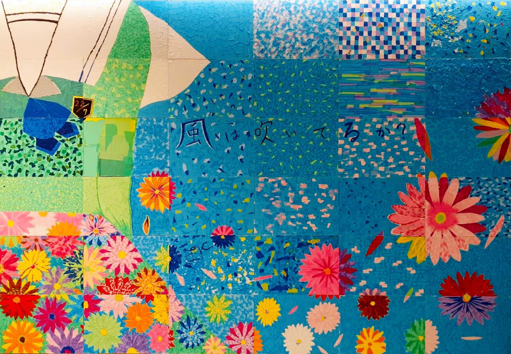

 
### 背景資料 Background Information
此為非官方 22/7 網頁，主要備份Twitter、Instagram及公式照等，並提供資訊，供粉絲使用及收藏。 
This is an unofficial 22/7 fan page. Mainly focusing on backup Twitter, Instagram and official photos etc. 
Also, provide useful information about 22/7. Please feel free to download and use. 
###### _^ 部分相片或會在不同相簿中重複出現 Some photos may appear in more than one of the Albums._

Project started in May/2020 

**最後更新日期 Last Update: 25Apr,2021 12:30 (HKT)**

### 相簿 Album
- [出道前 Pre-Debut](Docs/Album/PreDebut.md)
- [出道單曲 Debut Single](Docs/Album/1st%20Single.html)
- [第二單曲 2nd Single](Docs/Album/2nd%20Single.html)
- [角色設計 Character Design](Docs/Album/CharacterDesgin.md)
- [22/7 音楽の時間 Ongaku no Jikan](Docs/Album/Nanaon/Nanaon.md)
  
- [天城サリー Amaki Sally](Docs/Album/AmakiSally/AmakiSally.md)
- [花川芽衣 Hanakawa Mei](Docs/Album/HanakawaMei/HanakawaMei.md)
- [帆風千春 Hokaze Chiharu](Docs/Album/HokazeChiharu/HokazeChiharu.md)
- [河瀬詩 Kawase Uta](Docs/Album/KawaseUta/KawaseUta.md)
- [倉岡水巴 Kuraoka Mizuha](Docs/Album/KuraokaMizuha/KuraokaMizuha.md)
- [宮瀬玲奈 Miyase Reina](Docs/Album/MiyaseReina/MiyaseReina.md)
- [西條和 Saijo Nagomi](Docs/Album/SaijoNagomi/SaijoNagomi.md)
- [白沢かなえ Shirosawa Kanae](Docs/Album/ShirosawaKanae/ShirosawaKanae.md)
- [涼花萌 Suzuhana Moe](Docs/Album/SuzuhanaMoe/SuzuhanaMoe.md)
- [高辻麗 Takatsuji Urara](Docs/Album/TakatsujiUrara/TakatsujiUrara.md)
- [武田愛奈 Takeda Aina](Docs/Album/TakedaAina/TakedaAina.md)
- [海乃るり Umino Ruri](Docs/Album/UminoRuri/UminoRuri.md)

### 備份 Backup
- [Instagram](Docs/Backup/Instagram/IG_List.md)
- [Showroom](Docs/Backup/Showroom/Showroom_List.md)
- [YouTube](Docs/Backup/YouTube_List.md)
- [22/7 Official Blog](Docs/Backup/Blog/Blog_List.md)
- [22/7 Live](Docs/Backup/227Live/Live_List.md)
- [22/7 動畫 Anime](Docs/Backup/Anime/Anime_List.md)
- [22/7 電台節目 Radio](Docs/Backup/227Radio/Radio_List.md)
- [22/7 計算中 Keisanchu](Docs/Backup/227Keisanchu/227Keisanchu_List.md)
- [22/7 検算中 Kenzanchu](Docs/Backup/227Kenzanchu/227Kenzanchu_List.md)
- [22/7 相關影片 Related Videos](Docs/Backup/227Related/227Related.md)
- [二人三脚プロジェクト 2nin3kyaku Project](Docs/Backup/Nanaon/2nin3kyaku_List.md)
  
- [萬聖節限定頭像及壁紙 Halloween Special Icon & Wallpaper 2019](Docs/Backup/2019HalloweenSpecial.md)
- [22/7 計算中 放送紀念頭像及壁紙 Commemoration Icons & Wallpapers for 22/7 Keisanchuu](Docs/Backup/KeisanchuuBroadcast.md)
- [22/7 anime 20,000 followers 紀念頭像 Icon](Docs/Backup/TW20000fol.md)
- [22/7 anime 30,000 followers 紀念頭像 Icon](Docs/Backup/TW30000fol.md)
- [22/7 計算中 Blu-ray 發售紀念頭像 Commemoration Icons for release of 22/7 Keisanchuu Blu-ray](Docs/Backup/KeisanchuuBluray.md)

### 其他資訊 Other Information
- [音樂 Music](Docs/Music/Music_List.md)
- [雜誌 Magazines](Docs/Magazines/Magazines_List.md)
- [直播源 Live Stream](Docs/Streaming.md)
- [版主作品 Host's Creation](Docs/HostsCreation/HostsCreation.md)
- [22/7 日曆 Calender](Docs/Calendar.md)
- [22/7 官方商店 Official Online Store](Docs/OfficialStore.md)
  
- [Aniplex Online Fest](Docs/Backup/Aniplex_Online_Fest/AniplexFest_List.md)

### [鳴謝 Credit](Docs/Credit.md)

