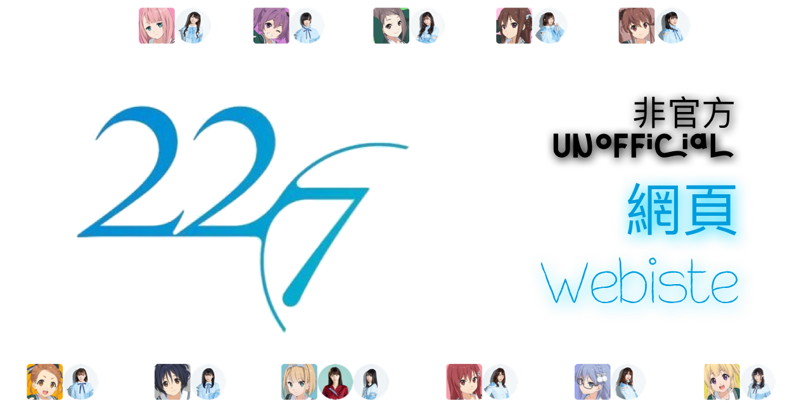

### 背景資料 Background Information
此為非官方 22/7 網頁，主要備份Twitter、Instagram及公式照等，並提供資訊，供粉絲使用及收藏。  
This is unofficial 22/7 website. Mainly focusing on backup Twitter, Instagram and official photos etc.  
Also provide useful information about 22/7. Please feel free to download and use.  
###### _^ 部分相片或會在不同相簿中重複出現 Some photos may appear in more than one of the Albums._

Project started at May/2020  

**最後更新日期 Last Update: 31Jul,2020 00:14 (HKT)**

### 相簿 Album
- [出道前 Pre-Debut](Markdown/Album/PreDebut.md)
- [出道單曲 Debut Single](Markdown/Album/1st%20Single.html)
- [第二單曲 2nd Single](Markdown/Album/2nd%20Single.html)
- [角色設計 Character Design](Markdown/Album/CharacterDesgin.md)
- [22/7 音楽の時間 Ongaku no Jikan](Markdown/Album/Nanaon/Nanaon.md)
  
- [天城サリー Amaki Sally](Markdown/Album/AmakiSally/AmakiSally.md)
- [花川芽衣 Hanakawa Mei](Markdown/Album/HanakawaMei/HanakawaMei.md)
- [帆風千春 Hokaze Chiharu](Markdown/Album/HokazeChiharu/HokazeChiharu.md)
- [河瀬詩 Kawase Uta](Markdown/Album/KawaseUta/KawaseUta.md)
- [倉岡水巴 Kuraoka Mizuha](Markdown/Album/KuraokaMizuha/KuraokaMizuha.md)
- [宮瀬玲奈 Miyase Reina](Markdown/Album/MiyaseReina/MiyaseReina.md)
- [西條和 Saijo Nagomi](Markdown/Album/SaijoNagomi/SaijoNagomi.md)
- [白沢かなえ Shirosawa Kanae](Markdown/Album/ShirosawaKanae/ShirosawaKanae.md)
- [涼花萌 Suzuhana Moe](Markdown/Album/SuzuhanaMoe/SuzuhanaMoe.md)
- [高辻麗 Takatsuji Urara](Markdown/Album/TakatsujiUrara/TakatsujiUrara.md)
- [武田愛奈 Takeda Aina](Markdown/Album/TakedaAina/TakedaAina.md)
- [海乃るり Umino Ruri](Markdown/Album/UminoRuri/UminoRuri.md)

### 備份 Backup  
- [22/7 Official Blog](Markdown/Backup/Blog/Blog_List.md)
- [22/7計算中 "22/7 Keisanchuu"](Markdown/Backup/227Keisanchuu/227Keisanchuu_List.md)
- [YouTube - 22/7 OFFICIAL YouTube CHANNEL](Markdown/Backup/227OfficialYouTube/227OfficialYouTube.md)
- [YouTube - Sally Amaki[official]](Markdown/Backup/Sally%20Amaki[official]/Sally%20Amaki[official].html)  
- [22/7 相關影片 Related Videos](Markdown/Backup/227Related/227Related.md)
  
- [萬聖節限定頭像及壁紙 Halloween Special Icon & Wallpaper 2019](Markdown/Backup/2019HalloweenSpecial.md)
- [22/7 計算中 放送紀念頭像及壁紙 Commemoration Icons & Wallpapers for 22/7 Keisanchuu](Markdown/Backup/KeisanchuuBroadcast.md)
- [22/7 anime 20,000 followers 紀念頭像 Icon](Markdown/Backup/TW20000fol.md)
- [22/7 anime 30,000 followers 紀念頭像 Icon](Markdown/Backup/TW30000fol.md)  

### 其他資訊 Other Information  
- [版主作品 Host's Creation](Markdown/HostsCreation.md)
- [22/7 日曆 Calender](Markdown/Calendar.md)  
- [22/7計算中 直播源 "22/7 Keisanchuu" Live Stream](Markdown/Streaming.md)
- [音樂 Music](Markdown/Music/Music_List.md)

### 鳴謝 Credit
###### _^ 排名不分先後 in arbitrary order_
Facebook
- [22/7 ナナブンのニジュウニ 香港應援支部 (22/7 Hong Kong Fans Group)](https://www.facebook.com/groups/2591995264350406)
- [ナナブンノニジュウニ交流討論區 22/7FansGroup](https://www.facebook.com/groups/227FG/)
- [22/7 Idol Group - International Fans](https://www.facebook.com/groups/274226923142369/)
- [Nanabun no nijuuni 22/7 - Ongaku no Jikan International Players](https://www.facebook.com/groups/703619237062957/)
- 22/7tw ナナブンのニジュウニ台灣情報頁 [@227FanTW](https://www.facebook.com/227FanTW/)
- 22/7音楽の時間～中文情報區～ [@nanaonzh](https://www.facebook.com/nanaonzh/)
- 22/7 ナナブンノニジュウニ Indonesia Fanspage [@nanabunnoID](https://www.facebook.com/pg/nanabunnoID/)
- 22/7 ナナニジ Seiyuu Posting [@227posting](https://www.facebook.com/227posting/)  

Twitter
- 22/7 English [@Nanaon_Eng](https://twitter.com/Nanaon_Eng)
- aga-yuu [@Agayuu1400](https://twitter.com/Agayuu1400)
- Felis [@felis_227](https://twitter.com/felis_227)
- 22/7 ファン [@227_fans](https://twitter.com/227_fans)  

Other
- [22/7 Fandom Wiki](https://nanabunnonijyuuni.fandom.com/wiki/22/7_Wiki)
- [22/7 Ongaku no Jikan Fandom Wiki](https://nanaon.fandom.com/wiki/Nanabunnonijyuuni:_Ongaku_no_Jikan_Wiki)
- [22/7 中文 Wiki](http://227cnwiki.com/wiki/%e9%a6%96%e9%a1%b5)
- [yande.re](https://yande.re/post)
- [bilibili - 227中文应援站](https://space.bilibili.com/118938280/)
- [bilibili - Sov](https://space.bilibili.com/730686/)
- [bilibili - ナナ二ジ的搬运工](https://space.bilibili.com/571233650/)  

<video width="100%" height="100%" controls>
  <source src="Vid/227 『風は吹いてるか？』.mp4" type="video/mp4">
</video>

